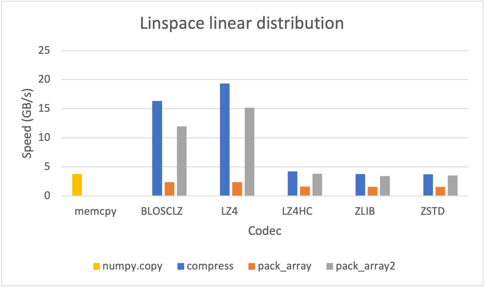
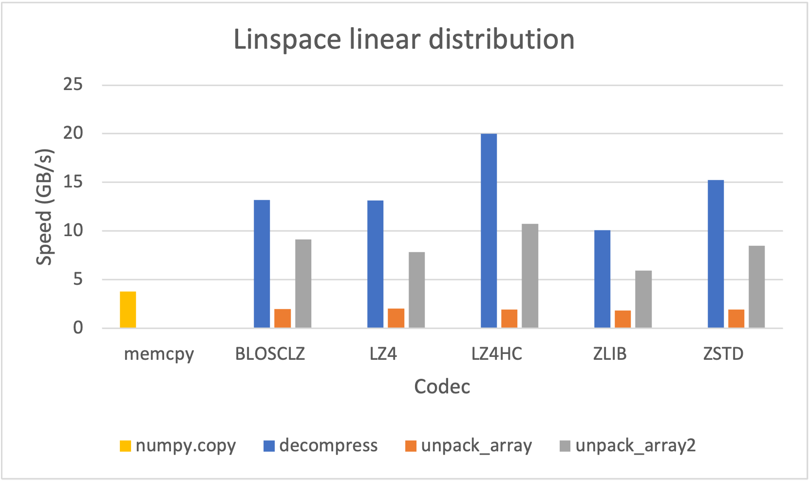
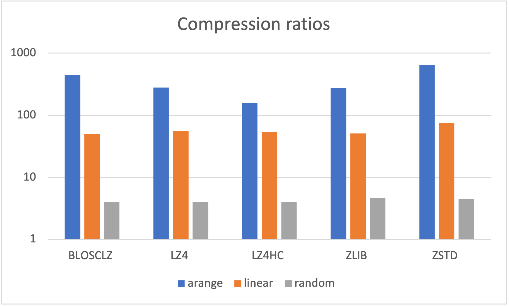
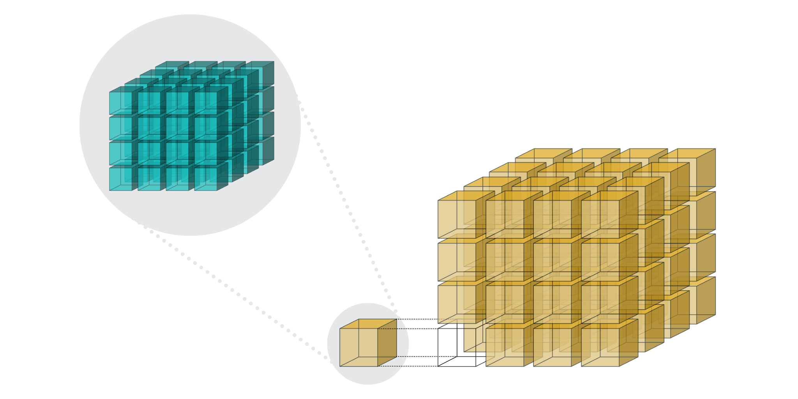
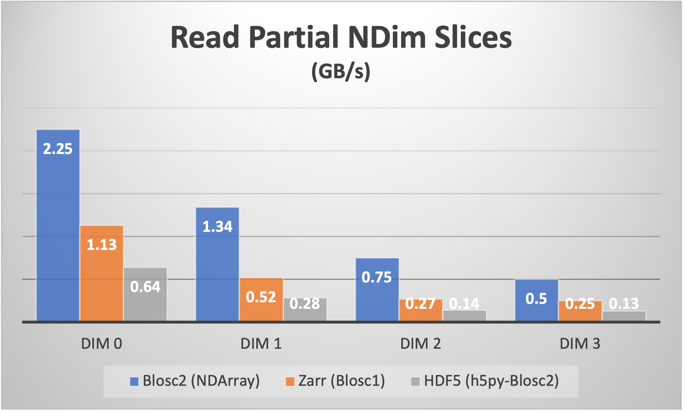
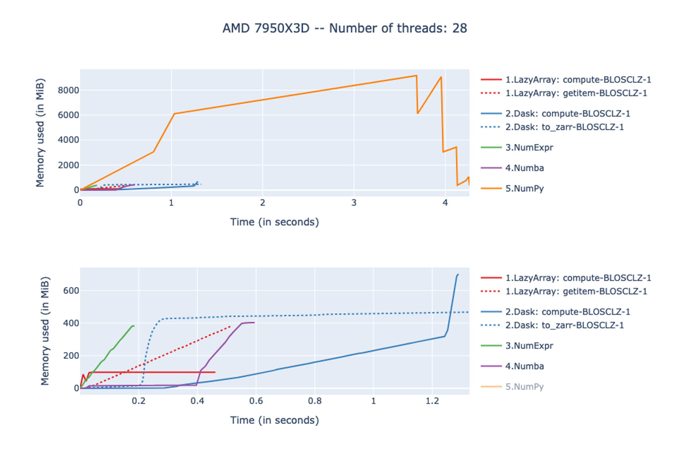
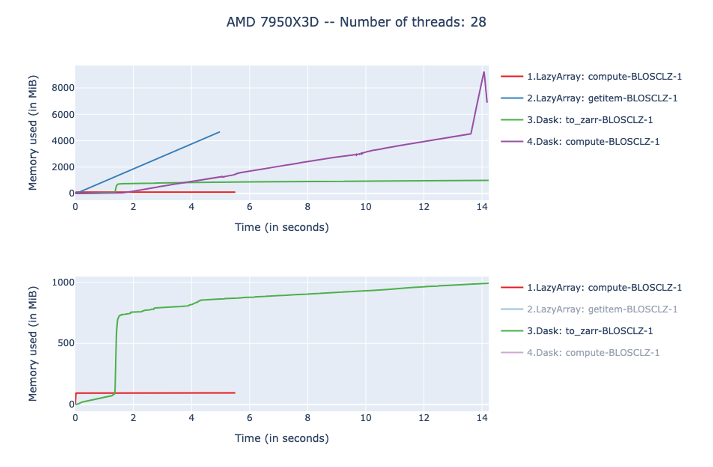

# Performance & Benchmarks

Python-Blosc2 is engineered around a central premise: **modern computation is memory-bound, not CPU-bound**. Over recent decades, processor clock speeds and core counts have outpaced memory bus bandwidth and storage I/O speeds (the classic "Memory Wall").

By compressing data with ultra-fast, SIMD-accelerated codecs and structuring arrays into two-level cache-aligned hierarchies (chunks and blocks), Python-Blosc2 often transmits less data over the memory bus, allowing computations and I/O to run significantly faster than with uncompressed data.

This document breaks down the architectural mechanics and benchmark results that illustrate how Python-Blosc2 achieves high performance across in-memory computations, out-of-core processing, and columnar queries.

---

## 1. Compression as an Accelerator

Traditional compression libraries focus primarily on archival: achieving maximum compression ratios at the expense of CPU time. In contrast, Blosc2 focuses on **real-time transmission acceleration**: making compression and decompression so fast that transferring compressed data through memory, disk, or network takes less total time than transferring uncompressed bytes.

### Serialization and Codec Throughput

Blosc2 supports a variety of modern codecs (BloscLZ, LZ4, LZ4HC, Zstandard, and Zlib) combined with byte-shuffling and bit-shuffling filters:

| Compression Speed | Decompression Speed |
| :---: | :---: |
|  |  |

- **Fast Codecs (LZ4, BloscLZ)**: Reach speeds exceeding **10–20 GB/s** on multi-core CPUs, operating near memory-bus wire speeds while reducing footprint.
- **High-Ratio Codecs (Zstandard)**: Deliver substantial compression ratios while still decompressing at multi-gigabyte-per-second rates.

### Compression Ratios Across Datatypes



Filters like `SHUFFLE`, `BITSHUFFLE`, and `BYTEDELTA` rearrange bytes so that neighboring elements with similar values compress significantly better, often achieving 5x–20x compression on scientific floating-point data without loss of precision.

### Learn More & Deep Dives
- {doc}`Tutorial 07: SChunk Basics <../tutorials/07.schunk-basics>` — Managing raw compressed chunk storage.
- {doc}`Tutorial 09: User Codecs & Filters <../tutorials/09.ucodecs-ufilters>` — Writing custom Python/C codecs and filters.
- Blog: [Enhancing the compression toolset with ByteDelta](https://www.blosc.org/posts/bytedelta-enhance-compression-toolset/)
- Blog: [Lossy compression in Blosc2](https://www.blosc.org/posts/blosc2-lossy-compression/)
- Blog: [Python-Blosc2 SChunk speed improvements](https://www.blosc.org/posts/python-blosc2-improvements/)

---

## 2. Double Partitioning & Multi-Dimensional Slicing

Traditional chunked storage formats divide N-dimensional arrays into single-level chunks. While this works well for coarse I/O, fetching a small slice or cross-section requires decompressing entire chunks.

Python-Blosc2 solves this with **two-level double partitioning**:



1. **Chunks (First Level)**: Coarse partitions sized for disk/network I/O (typically 1 MB – 64 MB).
2. **Blocks (Second Level)**: Fine-grained partitions sized to fit directly into CPU cache (typically 32 KB – 512 KB, matching L1/L2/L3 cache lines).

### Orthogonal Slicing Performance

Because each chunk contains indexed blocks, slicing an N-dimensional array along any axis ("pineapple-style" slicing) only requires decompressing the relevant blocks rather than whole chunks:



This architecture maintains high read throughput regardless of whether data is sliced along the row axis, column axis, or deeper tensor dimensions.

### Learn More & Deep Dives
- {doc}`Tutorial 01: NDArray Basics <../tutorials/01.ndarray-basics>` — Working with N-dimensional compressed arrays.
- {doc}`Optimization Tip 02: Chunk-aligned Slicing <optimization_tips>` — Structuring chunk shapes for maximum slicing speed.
- Blog: [Blosc2 NDim Introduction](https://www.blosc.org/posts/blosc2-ndim-intro/)
- Video: [Slicing N-Dimensional Datasets in Pineapple-Style](https://www.youtube.com/watch?v=LvP9zxMGBng)

---

## 3. Compute Engine & Lazy Expressions

Python-Blosc2 includes a high-speed compute engine designed for evaluating mathematical expressions directly on compressed data.

Expressions are represented lazily as `LazyExpr` or `LazyArray` instances, which execute chunk-by-chunk across threads, eliminating large intermediate uncompressed temporary arrays.

### In-Memory Computation (Operands fit in RAM)

For datasets that fit in memory (e.g., $20,000 \times 20,000$ `float64` elements, ~3.2 GB per operand), evaluating compound expressions such as:

$$\\text{expr} = ((a^3 + \\sin(c \\cdot 2)) < b) \\ \\& \\ (c > 0)$$

yields execution times that match or exceed top-tier computing libraries while consuming a fraction of the memory:



### Out-of-Core Computation (Operands exceed RAM)

When arrays are too large to fit in memory uncompressed (e.g., $70,000 \times 70,000$ `float64` elements, ~39 GB per operand), standard libraries like NumPy and NumExpr fail with `MemoryError`.

Python-Blosc2 processes data in compressed chunks from disk or memory, outperforming distributed frameworks like Dask+Zarr with dramatically lower CPU and memory overhead:



### Persistent Reductions

Reductions (such as `sum()`, `mean()`, `std()`, `min()`, `max()`) can be performed directly over compressed arrays on disk. Results can be preserved dynamically inside persistent expressions, allowing repeated downstream queries without recomputing intermediate reduction passes.

### JIT Compilation Acceleration

By setting the environment variable `BLOSC_ME_JIT=cc`, filter and reduction expressions are compiled on the fly with `-O3` optimizations and SIMD auto-vectorization using the system C compiler (clang/gcc), delivering an additional **~30% speedup** on large datasets.

### Learn More & Deep Dives
- {doc}`Tutorial 02: Lazy Expressions <../tutorials/02.lazyarray-expressions>` — Constructing and computing with `LazyExpr`.
- {doc}`Tutorial 03: DSL Kernels <../tutorials/03.lazyarray-udf-kernels>` — Fast compiled user-defined kernels.
- {doc}`Tutorial 04: Reductions <../tutorials/04.reductions>` — Optimizing reductions across large arrays.
- {doc}`Tutorial 05: Persistent Reductions <../tutorials/05.persistent-reductions>` — Dynamic reduction reuse.
- Blog: [Compute Bigger with Python-Blosc2](https://ironarray.io/blog/compute-bigger)
- Blog: [Evaluating Expressions at Blosc Speeds](https://ironarray.io/blog/blosc2-eval-expressions)
- Blog: [Persistent Reductions and Lazy Expressions](https://www.blosc.org/posts/persistent-reductions/)

---

## 4. Columnar Tables & Query Acceleration (`CTable`)

`CTable` is Python-Blosc2's high-performance columnar container. Each column is a compressed `NDArray`, inheriting the chunking, compression, and multi-threading engine.

### Key Architectural Advantages
- **No-Copy Querying**: Filtering conditions like `(t.tips > 100) & (t.km > 0)` evaluate directly over compressed columns in a single pass.
- **Automatic SUMMARY Indexes**: Min/max indexes are built per block at write time. During `where()` queries, entire blocks that cannot contain matches are skipped without decompression.
- **Fast Parquet & Arrow Interop**: Direct single-call import and export to Parquet and Apache Arrow tables.

### Tabular Query Benchmarks

On real-world tabular datasets like the Chicago Taxi dataset (~100M rows), queries on compressed `CTable` containers achieve speeds competitive with dedicated OLAP engines (such as DuckDB and Polars) while maintaining a smaller compressed footprint on disk and in memory.

### Learn More & Deep Dives
- {doc}`Tutorial 13: CTable Basics <../tutorials/13.ctable-basics>` — Building and querying tabular data.
- {doc}`Tutorial 15: Indexing CTables <../tutorials/15.indexing-ctables>` — Utilizing Summary Indexes for instant search.
- {doc}`Guide: Pandas Engine <pandas_engine>` — Accelerating Pandas computations with Blosc2.
- Blog: [Blosc2 is not an island: tabular ecosystem](https://blosc.org/posts/not-an-island-tabular-ecosystem/)

---

## 5. Distributed & Remote Array Acceleration

With `Proxy` and `C2Array`, Blosc2 containers transparently stream, cache, and slice datasets hosted on remote servers, HTTP endpoints, or cloud object stores (S3, GCS) via `fsspec`.

- **Byte-Range Reading**: Only the precise byte offsets for required chunks and blocks are downloaded over the network.
- **LRU Chunk Caching**: Frequently accessed chunks are automatically cached in local memory or disk, minimizing bandwidth consumption for repeated queries.

### Learn More & Deep Dives
- {doc}`Tutorial 06: Remote Proxy <../tutorials/06.remote_proxy>` — Client-side caching of remote datasets.
- {doc}`Guide: Remote Arrays <remote_arrays>` — Connecting Blosc2 to fsspec, Caterva2, and cloud buckets.

---

## 6. Reproducing Benchmarks Locally

All benchmark scripts and Jupyter notebooks referenced in this guide are open-source and included in the Python-Blosc2 repository under [`bench/`](https://github.com/Blosc/python-blosc2/tree/main/bench):

| Category | Benchmark Directory | Description |
| :--- | :--- | :--- |
| **NDArray & Lazy Expressions** | [`bench/ndarray/`](https://github.com/Blosc/python-blosc2/tree/main/bench/ndarray) | In-memory and out-of-core expression evaluation, reductions, slicing, and JIT comparisons. |
| **Columnar Tables** | [`bench/ctable/`](https://github.com/Blosc/python-blosc2/tree/main/bench/ctable) | Table indexing, append/extend throughput, and row iteration. |
| **Tabular Comparisons** | [`bench/chicago-taxi/`](https://github.com/Blosc/python-blosc2/tree/main/bench/chicago-taxi) | Chicago Taxi benchmark comparing Blosc2 with DuckDB, Polars, PyArrow, and Pandas. |
| **Optimization Tips** | [`bench/optim_tips/`](https://github.com/Blosc/python-blosc2/tree/main/bench/optim_tips) | Reproducible scripts for all optimization tips. |

To run any benchmark locally:
```bash
# Clone the repository
git clone https://github.com/Blosc/python-blosc2.git
cd python-blosc2

# Run an NDArray expression benchmark
python bench/ndarray/lazyarray-constructors.py

# Run a CTable query comparison
python bench/ctable/ctable_v_pandas.py
```
