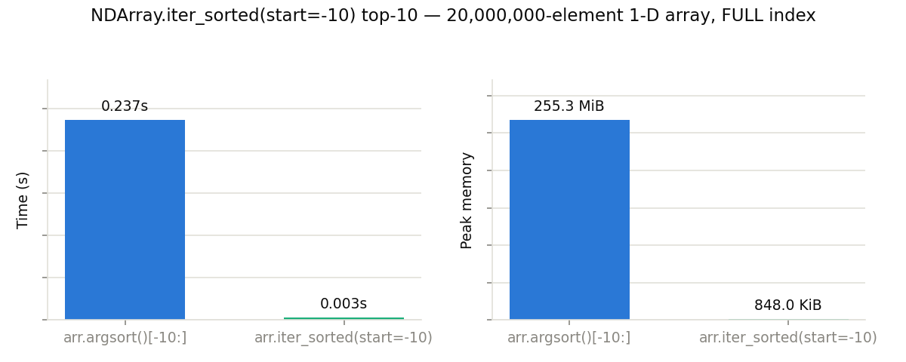
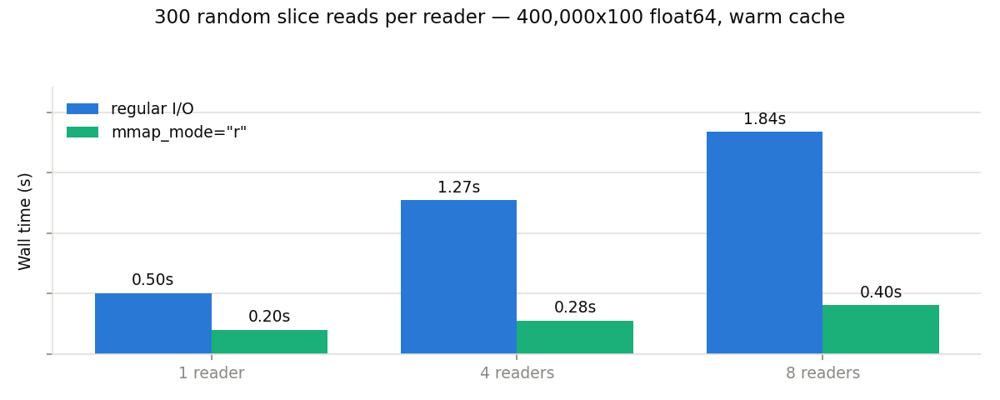
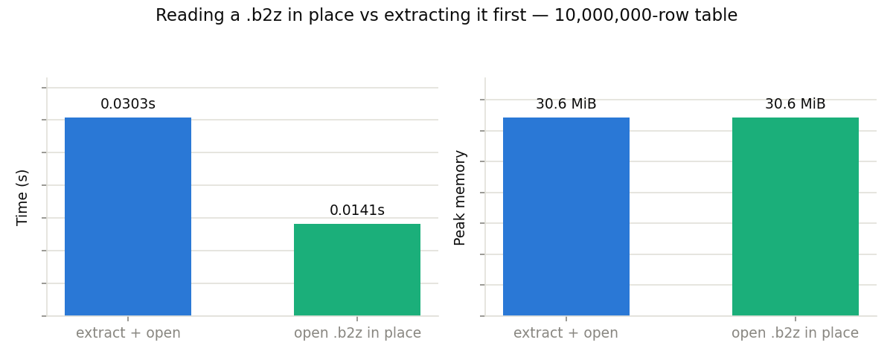

# Optimization tips

This page collects small idioms that make a measurable difference in speed or memory (often both). Each one is backed by a small benchmark in [`bench/optim_tips/`](https://github.com/Blosc/python-blosc2/tree/main/bench/optim_tips), which you can run yourself — see the [bench/optim_tips README](https://github.com/Blosc/python-blosc2/tree/main/bench/optim_tips/README.md).

Numbers below were measured on an Apple M4 Pro Mac Mini (macOS, Python 3.14); absolute values will differ on your machine, but the direction and rough magnitude of each effect should not.

## Build large arrays with blosc2's own constructors

Constructors like `blosc2.arange()`, `blosc2.linspace()` and `blosc2.fromiter()` fill an `NDArray` chunk by chunk, using multiple threads. Building the same array in NumPy first and compressing it with `asarray()` means holding the whole thing uncompressed in memory at once.

```python
# Avoid: materializes the full array in NumPy first
a = blosc2.asarray(np.linspace(0, 1, N))

# Prefer: fills the NDArray chunk by chunk
a = blosc2.linspace(0, 1, N)
```


At 200M float64 elements, the two are comparable in speed, but the real win is memory: **~25x less peak memory**, and the gap widens with array size — the naive path's memory is O(N), while the constructor's stays roughly O(chunk size) for compressible enough data. The same applies to `arange()` and `fromiter()`.

*Benchmark for this tip: [`tip_01_constructors.py`](https://github.com/Blosc/python-blosc2/blob/main/bench/optim_tips/tip_01_constructors.py)*

## Align your reads with the double partition

blosc2 arrays are partitioned twice: the array is split into **chunks** (the unit of storage and compression), and each chunk is subdivided into **blocks** (the unit of decompression, sized to fit CPU caches). A read that lands exactly on a partition boundary decompresses only the chunk or block it needs, while the same-sized read shifted off-grid straddles (and decompresses) extra ones.

You don't have to pick the partitions yourself: let blosc2 choose them, then read them back from `arr.chunks` and `arr.blocks` to place your slice boundaries.

### At the chunk level

`NDArray.slice()` has a fast path when *both* boundaries land on chunk boundaries: whole chunks are copied as-is, compressed, with no decompression at all. Regular reads also benefit — an aligned chunk-sized read decompresses one chunk instead of two.

```python
arr = blosc2.asarray(data)  # let blosc2 pick the partitions
ch = arr.chunks[0]  # e.g. 1000 for a 16000×2000 float64 array

# Avoid: a chunk-sized read straddling two chunks → decompresses both
arr[ch // 2 : ch // 2 + ch, :]

# Aligned read: on the chunk grid → decompresses exactly one chunk
arr[ch : 2 * ch, :]

# Even better: slice() on chunk boundaries → copies chunks as-is, no decompress
arr.slice((slice(ch, 2 * ch), slice(None)))
```

### At the block level

The same alignment principle applies at the block level: a block-aligned read decompresses exactly the blocks it needs. With auto-chosen blocks this effect is small — blocks are tiny by design — but if you configure larger blocks (say, for better compression ratios), keeping reads on the block grid pays off.

The `slice()` fast path, however, does *not* apply here: it only works at chunk boundaries, so `slice()` of a block-sized region still decompresses and recompresses:

```python
big = blosc2.asarray(data, chunks=(4000, 2000), blocks=(100, 2000))
bl = big.blocks[0]

# Avoid: a block-sized read straddling two blocks → decompresses both
big[bl // 2 : bl // 2 + bl, :]

# Aligned read: on the block grid → decompresses exactly one block
big[bl : 2 * bl, :]

# slice() at block granularity → still decompresses + recompresses the chunk
big.slice((slice(bl, 2 * bl), slice(None)))
```


On a 16000×2000 float64 array, 400 chunk-sized reads aligned with the chunk grid were **~2.2× faster** than the same reads shifted half a chunk off-grid, and a chunk-aligned `slice()` was **~4.9× faster** still (no decompression). At the block level (with larger 1.6 MB blocks), 400 block-sized reads aligned with the block grid were **~1.7× faster**. However, `slice()` at block granularity was no faster at all — `slice()` has to produce a valid compressed array with its own chunk layout, so it can only skip decompression when both boundaries land on *chunk* boundaries; at block granularity it still decompresses and recompresses.

*Benchmark for this tip: [`tip_02_chunk_aligned_slicing.py`](https://github.com/Blosc/python-blosc2/blob/main/bench/optim_tips/tip_02_chunk_aligned_slicing.py)*

## Sorted top-k: stream from FULL indexes

A `FULL` index stores rows in sorted order. When all you need is the top (or
bottom) *k* rows, you can stream just that slice directly from the index
sidecar instead of materialising the full sorted permutation. Both
{class}`~blosc2.CTable` and {class}`~blosc2.NDArray` expose this.

### CTable: ``sort_by(view=True)``

{meth}`CTable.sort_by(view=True) <blosc2.CTable.sort_by>` returns a
lightweight sorted *view* that gathers rows from the parent table on demand.
On a FULL-indexed column it streams straight from the index — the table is
never actually sorted at all:

```python
t.create_index("temperature", kind=blosc2.IndexKind.FULL)

# Avoid: sorts (and copies) the whole table just to keep 10 rows
top10 = t.sort_by("temperature")[:10]

# Prefer: zero-copy view, streamed from the index
top10 = t.sort_by("temperature", view=True)[:10]
```


On a 20M-row table, the view form took **~74× less time** and about 25% less
peak memory than a full ``sort_by()``.  The larger the table relative to
*k*, the bigger the gap, since the naive path's cost is dominated by sorting
rows you're about to discard.

*Benchmark: [`tip_03_sort_by_view.py`](https://github.com/Blosc/python-blosc2/blob/main/bench/optim_tips/tip_03_sort_by_view.py)*

### NDArray: ``iter_sorted(start=-k)``

For 1-D {class}`~blosc2.NDArray` objects, {meth}`NDArray.iter_sorted(start=-k)
<blosc2.NDArray.iter_sorted>` reads just the tail of the index sidecar,
avoiding the full permutation that {func}`argsort() <blosc2.argsort>`
would materialise:

```python
arr.create_index(kind=blosc2.IndexKind.FULL)

# Avoid: materialises all 20M positions just to keep 10
top10 = arr[arr.argsort()[-10:]]

# Prefer: reads only the last 10 entries from the sidecar
from blosc2 import asarray

top10 = asarray(list(arr.iter_sorted(start=-10)))
```

Descending and bottom-k work via ``step=-1``:

```python
list(arr.iter_sorted(start=-1, stop=-11, step=-1))  # top-10 descending
list(arr.iter_sorted(stop=10))  # bottom-10 ascending
list(arr.iter_sorted(start=9, stop=None, step=-1))  # bottom-10 descending
```



On a 20M-element float64 array, ``iter_sorted(start=-10)`` was **~52× faster**
and used **~193× less peak memory** than ``argsort()[-10:]`` — the latter
still materialises the full 20M-element positions array even when backed by a
FULL index.

*Benchmark: [`tip_03b_ndarray_iter_sorted.py`](https://github.com/Blosc/python-blosc2/blob/main/bench/optim_tips/tip_03b_ndarray_iter_sorted.py)*

## Let SUMMARY indexes answer `min()`/`max()` directly

When closing a `CTable`, Blosc2 automatically builds `SUMMARY` indexes (per-block min/max) for its eligible scalar columns — this is on by default (`create_summary_index=True`). `Column.min()`/`max()` (and `argmin()`/`argmax()` inside `group_by()`) then answer from those precomputed summaries instead of decompressing the column at all.

```python
# create_summary_index=True is the default; closing the table builds the index
with blosc2.CTable(Row, urlpath="t.b2d", mode="w") as t:
    t.extend(data)

t = blosc2.open("t.b2d")
hottest = t["temperature"].max()  # answered from the SUMMARY index
```


On a 10M-row column, the indexed `max()` took ~4x less time than without an index, and needed essentially no extra memory — it never touches the compressed column data at all.

The same SUMMARY indexes can also let a selective `where()` query skip whole blocks, but only when the column's values are ordered or clustered enough that a block's min/max range can exclude the predicate entirely. With independently random data every block spans nearly the full value range and there is nothing to skip — so the `min()`/`max()` speedup is the one you can always count on.

*Benchmark for this tip: [`tip_04_summary_index_where.py`](https://github.com/Blosc/python-blosc2/blob/main/bench/optim_tips/tip_04_summary_index_where.py)*

## Reduce columns directly — don't slice them first

`t["col"][:]` materializes the whole column as one big NumPy array. If all you want is a reduction, call it on the `Column` itself: `sum()`, `mean()`, `min()`, ... work chunk by chunk and never hold the whole column decompressed at once — while still handling null values and deleted rows correctly.

```python
# Avoid: decompresses the whole column into one NumPy array first
total = t["val"][:].sum()

# Prefer: chunk-wise reduction straight over the compressed column
total = t["val"].sum()
```

![col.sum() vs col[:].sum()](optim_tips/tip_05_column_reduce.png)

On a 50M-row column, `col.sum()` was 1.7x faster, but more importantly it used **~12x less peak memory**. For large tables the memory savings alone can be the deciding factor.

*Benchmark for this tip: [`tip_05_column_reduce.py`](https://github.com/Blosc/python-blosc2/blob/main/bench/optim_tips/tip_05_column_reduce.py)*

## Filtered reductions: push the predicate down with `where=`

The previous tip extends to filtered aggregates. The NumPy-style idiom — materialize the value column *and* the predicate column, build a boolean mask, then reduce — decompresses both columns in full just to keep a fraction of the rows. Column reductions accept a `where=` predicate instead, which is pushed down into the same chunk-wise scan: no intermediate arrays, no filtered view.

```python
# Avoid: decompresses both full columns just to mask one of them
temp = t["temperature"][:]
reg = t["region"][:]
total = temp[reg == 3].sum()

# Prefer: the filter travels with the chunk-wise reduction
total = t["temperature"].sum(where=t.region == 3)
```


On a 20M-row table, the pushed-down form was **~1.9x faster** and used **~7x less peak memory**. Predicates can combine several columns too: `t["amount"].sum(where=(t.price < 300) & (t.qty > 0))`.

*Benchmark for this tip: [`tip_08_where_pushdown.py`](https://github.com/Blosc/python-blosc2/blob/main/bench/optim_tips/tip_08_where_pushdown.py)*

## Memory-map read-only opens

`blosc2.open(path, mmap_mode="r")` memory-maps the file instead of going through regular file I/O, so chunks are read directly from the mapped pages — no per-access open/seek/read syscalls, and no intermediate buffer copy. For workloads that touch many scattered chunks, this adds up.

```python
# Avoid (for read-heavy, scattered access): regular I/O per chunk
arr = blosc2.open(path)

# Prefer: map the file once, read pages directly
arr = blosc2.open(path, mmap_mode="r")
```


Across 8,000 scattered slice reads, `mmap_mode="r"` was **~1.1x faster**; peak memory was essentially identical for this single-process, single-open workload.

A single warm-cache process, as benchmarked here, is actually the *worst* case for showing mmap off — the payoff multiplies with several readers on the same file, which is the next tip.

*Benchmark for this tip: [`tip_06_mmap_read.py`](https://github.com/Blosc/python-blosc2/blob/main/bench/optim_tips/tip_06_mmap_read.py)*

## Many readers on one file? mmap in every one of them

When several processes read the same blosc2 file concurrently, open it with `mmap_mode="r"` in *each* reader. Every regular-I/O access pays a syscall plus a copy from the OS page cache into private buffers, and that per-access overhead compounds under kernel contention — while mmap readers all go straight to a single, shared set of mapped pages. So the speedup *grows* with the number of readers, and physical memory stays at roughly one copy of the file no matter how many readers attach.

```python
# Avoid: each reader process pays syscalls + private buffer copies
arr = blosc2.open(path)  # reader 1..N

# Prefer: all readers share one set of mapped pages
arr = blosc2.open(path, mmap_mode="r")  # reader 1..N
```



With 8 concurrent readers doing random slice reads over a 269 MB array, mmap was **~4.5x faster** in wall time (2.5x for a single reader) and used less than half the total CPU. Don't be alarmed if mmap readers *look* heavier in RSS — each process charges the shared mapped pages it touched, but they exist once physically; per-process private memory is identical in both modes. The full discussion, including the measurement table, is in the [Sharing containers across processes](sharing_across_processes.md) guide's colophon; see that guide too for the multi-reader/NFS/Windows caveats.

*Benchmark for this tip: [`tip_10_mmap_many_readers.py`](https://github.com/Blosc/python-blosc2/blob/main/bench/optim_tips/tip_10_mmap_many_readers.py)*

## Use `.b2z` to group related data into one memory-mapped file

`.b2z` packs related data — a `CTable`'s columns and indexes, hierarchies of arrays, or both — into a single-file container that blosc2 reads *in place*: opened read-only, nothing is ever unpacked, and with `mmap_mode="r"` every member is memory-mapped at its offset inside the container. Beyond the convenience of one file to copy or archive, this buys you:

- **mmap out of the box** — one mapping of one file covers the whole dataset, and the OS shares its pages across every reader process.
- **One file open instead of hundreds** — a wide `.b2d` directory can hold 100+ leaf files, each costing an open/stat metadata round-trip; on network filesystems or with cold caches, that latency dominates.
- **Atomic replacement** — `to_b2z()` swaps the file atomically, so readers always see the complete old dataset or the complete new one, never a mix; a directory of files can't guarantee that.
- **No per-file allocation slack** — many small leaves each round up to a filesystem block in a `.b2d`; packed members don't, which can shrink wide datasets considerably.
- **Layout locality** — members sit contiguously in one file, so full scans read sequentially instead of seeking across scattered files.

Don't treat it as an archive to extract before use:

```python
# Avoid: unpacking first — extra time and a second copy on disk
with zipfile.ZipFile("data.b2z") as z:
    z.extractall("data.b2d")
t = blosc2.open("data.b2d")

# Prefer: one open, one mapping, straight from the container
t = blosc2.open("data.b2z", mmap_mode="r")
```



On a 10M-row table, opening in place and summing a column was **~2x faster** than extract-then-open (identical peak memory), and it leaves no unpacked copy behind. The multi-reader advantages are the same as in the [memory-map tip above](#memory-map-read-only-opens), only with a single mapping serving the whole dataset.

One asymmetry to keep in mind: `.b2z` is optimized for reading, while a *writable* `.b2z` is staged in a temporary directory and rezipped on close — for write-heavy workloads, build the table as `.b2d` and pack it with `to_b2z()` when it's ready to publish.

*Benchmark for this tip: [`tip_09_b2z_read_in_place.py`](https://github.com/Blosc/python-blosc2/blob/main/bench/optim_tips/tip_09_b2z_read_in_place.py)*

## Skip constraint checks in `extend()` with `validate=False`

You can pass a `blosc2.NDArray` directly as a column value to `CTable.extend()`: both the write *and* the constraint validation happen chunk by chunk, so the array is never fully decompressed — it goes from compressed source to compressed column with only O(chunk) extra memory. Columns with no declared constraints skip validation automatically.

But for a column that *does* declare constraints (`ge=`, `max_length=`, ...), validation still has to decompress and check every chunk; if you already know the data is valid, `validate=False` skips that pass.

```python
# Default: every chunk is decompressed once to check declared constraints
t.extend({"val": src})

# Prefer, for known-good data: skip the constraint checks entirely
t.extend({"val": src}, validate=False)
```


Extending a table with a 20M-row `NDArray` column carrying a `ge=0` constraint, `validate=False` was **~1.4x faster**; peak memory was similar, since validation is chunk-wise anyway.

*Benchmark for this tip: [`tip_07_chunked_writes.py`](https://github.com/Blosc/python-blosc2/blob/main/bench/optim_tips/tip_07_chunked_writes.py)*
