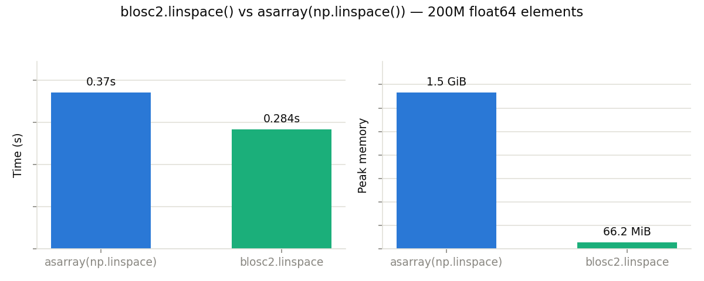
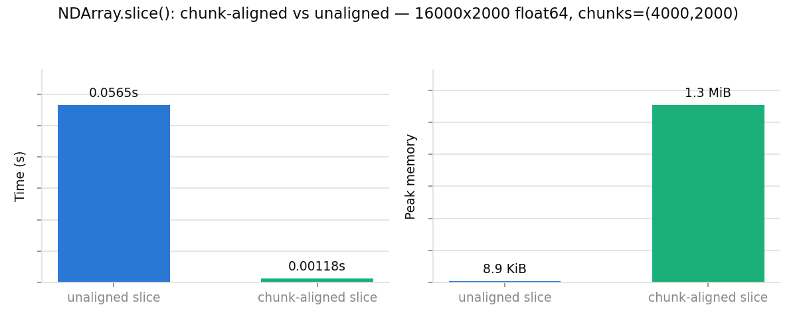
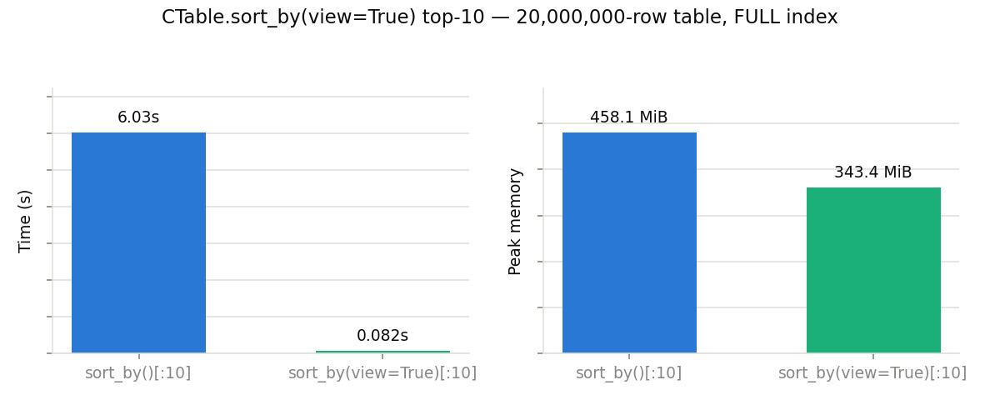
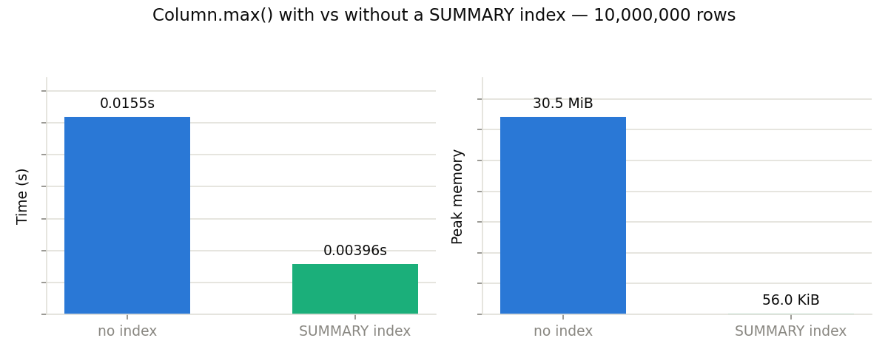
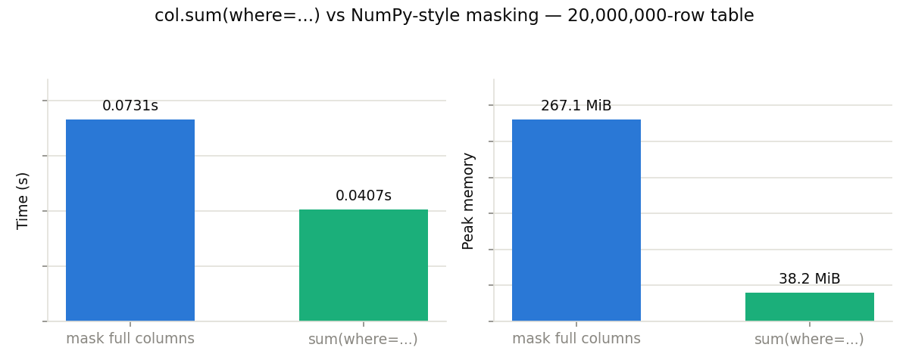
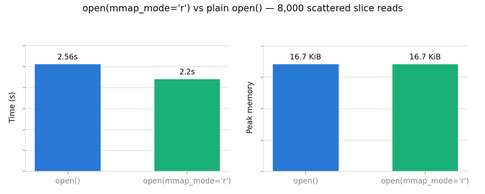
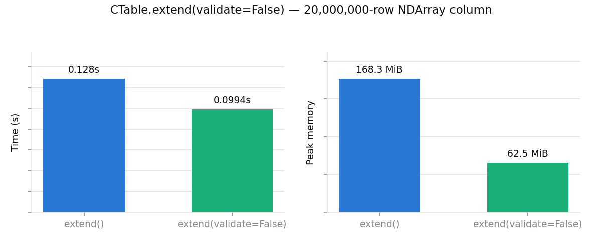

# Optimization tips

This page collects small idioms that make a measurable difference in speed or memory (often both). Each one is backed by a small benchmark in [`bench/optim_tips/`](https://github.com/Blosc/python-blosc2/tree/main/bench/optim_tips), which you can run yourself — see the
[bench/optim_tips README](https://github.com/Blosc/python-blosc2/tree/main/bench/optim_tips/README.md).

Numbers below were measured on an Apple M4 Pro Mac Mini (macOS, Python 3.14); absolute values will differ on your machine, but the direction and rough magnitude of each effect should not.

## Build large arrays with blosc2's own constructors

Constructors like `blosc2.arange()`, `blosc2.linspace()` and `blosc2.fromiter()` fill an `NDArray` chunk by chunk, using multiple threads. Building the same array in NumPy first and compressing it with `asarray()` means holding the whole thing uncompressed in memory at once.

```python
# Avoid: materializes the full array in NumPy first
a = blosc2.asarray(np.linspace(0, 1, N))

# Prefer: fills the NDArray chunk by chunk
a = blosc2.linspace(0, 1, N)
```



At 200M float64 elements, the two are comparable in speed, but the real win is memory: **~25x less peak memory**, and the gap widens with array size — the naive path's memory is O(N), while the constructor's stays roughly O(chunk size) for compressible enough data. The same applies to `arange()` and `fromiter()`.

## Align slices with the chunk grid

`NDArray.slice()` has a fast path when a slice's boundaries land exactly on chunk boundaries: whole chunks are copied as-is, with no decompress/recompress. A slice that starts or ends mid-chunk falls back to the general path.

```python
arr = blosc2.asarray(data, chunks=(4000, 2000))

# Avoid: mid-chunk boundaries force decompress + recompress
arr.slice((slice(500, 12500), slice(None)))

# Prefer: boundaries match the chunk grid -> whole chunks copied as-is
arr.slice((slice(4000, 16000), slice(None)))
```



The aligned slice was **~45x faster** on a 16000x2000 float64 array. (Ignore the memory panel for this one: the fast path's footprint — just the compressed chunks passing through — happens to be visible to our measurement, while the general path's much larger decompression scratch lives in C buffers the measurement cannot see. The aligned path actually moves *less* memory around, not more.)

If you control chunk sizes, pick slice boundaries — or a `chunks=` shape — that line up with how you plan to read the array.

## Sorted top-k via `sort_by(view=True)`

`CTable.sort_by(view=True)` returns a lightweight sorted *view* that gathers rows from the parent table on demand, instead of materializing a whole sorted copy. On a column with a `FULL` index it streams straight from the index, so the table is never actually sorted at all.

```python
t.create_index("temperature", kind=blosc2.IndexKind.FULL)

# Avoid: sorts (and copies) the whole table just to keep 10 rows
top10 = t.sort_by("temperature")[:10]

# Prefer: zero-copy view, streamed from the index
top10 = t.sort_by("temperature", view=True)[:10]
```



On a 2M-row table, the view form took **~45x less time** — while also using about 25% less peak memory. The larger the table relative to *k*, the bigger this gap gets, since the naive path's cost is dominated by sorting rows you're about to discard.

Views are also available for `group_by()` and `where()` queries, so use them whenever you don't need a materialized copy.

## Let SUMMARY indexes answer `min()`/`max()` directly

When closing a `CTable`, Blosc2 automatically builds `SUMMARY` indexes (per-block min/max) for its eligible scalar columns — this is on by default (`create_summary_index=True`). `Column.min()`/`max()` (and `argmin()`/`argmax()` inside `group_by()`) then answer from those precomputed summaries instead of decompressing the column at all.

```python
# create_summary_index=True is the default; closing the table builds the index
with blosc2.CTable(Row, urlpath="t.b2d", mode="w") as t:
    t.extend(data)

t = blosc2.CTable.open("t.b2d")
hottest = t["temperature"].max()  # answered from the SUMMARY index
```



On a 10M-row column, the indexed `max()` took ~4x less time than without an index, and needed essentially no extra memory — it never touches the compressed column data at all.

The same SUMMARY indexes can also let a selective `where()` query skip whole blocks, but only when the column's values are ordered or clustered enough that a block's min/max range can exclude the predicate entirely. With independently random data every block spans nearly the full value range and there is nothing to skip — so the `min()`/`max()` speedup is the one you can always count on.

## Reduce columns directly — don't slice them first

`t["col"][:]` materializes the whole column as one big NumPy array. If all you want is a reduction, call it on the `Column` itself: `sum()`, `mean()`, `min()`, ... work chunk by chunk and never hold the whole column decompressed at once — while still handling null values and deleted rows correctly.

```python
# Avoid: decompresses the whole column into one NumPy array first
total = t["val"][:].sum()

# Prefer: chunk-wise reduction straight over the compressed column
total = t["val"].sum()
```

![col.sum() vs col[:].sum()](optim_tips/tip_05_column_reduce.png)

On a 50M-row column, `col.sum()` was 1.7x faster, but more importantly it used **~12x less peak memory**. For large tables the memory savings alone can be the deciding factor.

## Filtered reductions: push the predicate down with `where=`

The previous tip extends to filtered aggregates. The NumPy-style idiom — materialize the value column *and* the predicate column, build a boolean mask, then reduce — decompresses both columns in full just to keep a fraction of the rows. Column reductions accept a `where=` predicate instead, which is pushed down into the same chunk-wise scan: no intermediate arrays, no filtered view.

```python
# Avoid: decompresses both full columns just to mask one of them
temp = t["temperature"][:]
reg = t["region"][:]
total = temp[reg == 3].sum()

# Prefer: the filter travels with the chunk-wise reduction
total = t["temperature"].sum(where=t.region == 3)
```



On a 20M-row table, the pushed-down form was **~2x faster** and used **~7x less peak memory**. Predicates can combine several columns too: `t["amount"].sum(where=(t.price < 300) & (t.qty > 0))`.

## Memory-map read-only opens

`blosc2.open(path, mmap_mode="r")` memory-maps the file instead of going through regular file I/O, so chunks are read directly from the mapped pages — no per-access open/seek/read syscalls, and no intermediate buffer copy. For workloads that touch many scattered chunks, this adds up.

```python
# Avoid (for read-heavy, scattered access): regular I/O per chunk
arr = blosc2.open(path)

# Prefer: map the file once, read pages directly
arr = blosc2.open(path, mmap_mode="r")
```



Across 8,000 scattered slice reads, `mmap_mode="r"` was **~1.2x faster**; peak memory was essentially identical for this single-process, single-open workload.

The bigger real-world payoff shows up with cold OS caches and with multiple readers/processes sharing one file, where mapped pages are shared rather than each reader paying its own I/O and buffer-copy cost — a single warm-cache process, as benchmarked here, is the worst case for showing it off. See the [Sharing containers across processes](sharing_across_processes.rst) guide for the multi-reader/NFS/Windows caveats.

## Skip constraint checks in `extend()` with `validate=False`

You can pass a `blosc2.NDArray` directly as a column value to `CTable.extend()`: both the write *and* the constraint validation happen chunk by chunk, so the array is never fully decompressed — it goes from compressed source to compressed column with only O(chunk) extra memory. Columns with no declared constraints skip validation automatically.

But for a column that *does* declare constraints (`ge=`, `max_length=`, ...), validation still has to decompress and check every chunk; if you already know the data is valid, `validate=False` skips that pass.

```python
# Default: every chunk is decompressed once to check declared constraints
t.extend({"val": src})

# Prefer, for known-good data: skip the constraint checks entirely
t.extend({"val": src}, validate=False)
```



Extending a table with a 20M-row `NDArray` column carrying a `ge=0` constraint, `validate=False` was **~1.4x faster**; peak memory was similar, since validation is chunk-wise anyway.
