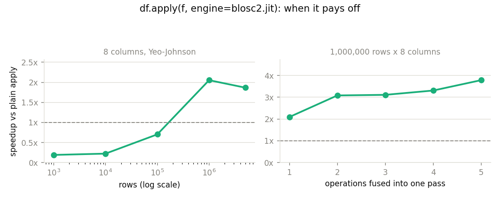

# Using Blosc2 as a pandas Engine

pandas' `DataFrame.apply` and `Series.map` accept an `engine=` argument, and
`blosc2.jit` is one such engine. Instead of running your function once per
element in a Python loop, pandas hands it the **whole column at once**, and
Blosc2 evaluates the entire function body in a single multi-threaded pass
over the data.

The result is typically **2-3x faster than a plain `apply`**, with the
function itself left exactly as you wrote it.

## An example

Yeo-Johnson is the power transform behind scikit-learn's `PowerTransformer`,
used to make skewed features more normally distributed. Its parameter is
fitted per column, so applying it to every column of a feature matrix is
precisely what you want:

```python
import numpy as np
import pandas as pd

import blosc2

rng = np.random.default_rng(0)
df = pd.DataFrame({f"c{i}": rng.normal(size=1_000_000) for i in range(8)})


@blosc2.jit
def yeo_johnson(col, lam=0.5):
    # np.where evaluates both arms, so clamp each to its own domain
    pos = (np.power(np.maximum(col, 0.0) + 1.0, lam) - 1.0) / lam
    neg = -(np.power(np.maximum(-col, 0.0) + 1.0, 2.0 - lam) - 1.0) / (2.0 - lam)
    return np.where(col >= 0, pos, neg)


result = df.apply(yeo_johnson, engine=blosc2.jit)
```

`result` is a DataFrame of the same shape and column names as `df`, with the
transform applied to every column — the same thing plain `df.apply(yeo_johnson)`
returns, only computed differently. On the machine below it takes 0.056 s
instead of 0.119 s, a **2.1x** speedup.

## Why it is faster

Evaluated by NumPy, that function body is a sequence of separate steps: raise
to a power, subtract, divide, do it again for the negative branch, then select.
Each step walks the full column and allocates a new full-size temporary array
to hold its result.

Blosc2 does not execute the steps one at a time. It captures the whole
expression first, then makes a single pass over the data, computing every step
on one small piece while that piece is still in cache, and spreading the pieces
across cores. The intermediate arrays are never created.

## When it pays off

Two things have to be true, and the plot below measures each one on its own.



**Enough rows.** Setting up the compute engine costs a fixed amount per call.
At a few hundred thousand rows that setup is still larger than anything it
saves, and the engine is a net loss — at 100,000 rows it runs at 0.70x. Break-even
falls between 100,000 and 1,000,000 rows.

**Enough arithmetic.** The more operations there are to fuse into one pass, the
more temporaries are avoided and the bigger the win — from 2.1x for a single
operation up to 3.8x for five.

Beyond a few million rows the speedup flattens and then eases off (1.9x at 5M
above): the arrays no longer fit in cache and the whole computation becomes
limited by memory bandwidth, which fusion can reduce but not eliminate.

## When not to use it

**Trivial expressions.** Arithmetic intensity matters more than the raw number
of operations. A single cheap operation over a large array is limited by memory
bandwidth, not by computation, so there is nothing for the engine to win back:

```python
result = df.apply(lambda col: col + 1, engine=blosc2.jit)  # 0.53x — slower!
```

That runs at roughly **half** the speed of a plain `apply`. Reach for the engine
when the function does real work per element, such as transcendental functions
or several chained operations.

**Small frames.** See the plot above: below a few hundred thousand rows, use a
plain `apply`.

## Compared to `pd.eval` and numexpr

pandas' own [Enhancing performance](https://pandas.pydata.org/docs/user_guide/enhancingperf.html)
guide describes `pd.eval(..., engine="numexpr")`, which fuses expressions using
the same underlying idea. It is worth being straightforward about how the two
compare on the example above:

| approach | time | vs plain apply |
| --- | --- | --- |
| plain `df.apply(f)` | 0.1194 s | 1.00x |
| `df.apply(f, engine=blosc2.jit)` | 0.0561 s | 2.13x |
| `numexpr.evaluate(...)` per column | 0.0380 s | 3.14x |

On an in-memory DataFrame, numexpr is somewhat faster. The reason to prefer
`engine=blosc2.jit` is not raw speed but that **you write a Python function
rather than a quoted string**. The numexpr equivalent of `yeo_johnson` has to
become a single expression:

```python
"where(c >= 0, "
"((maximum(c, 0.0) + 1.0) ** lam - 1.0) / lam, "
"-((maximum(-c, 0.0) + 1.0) ** (2.0 - lam) - 1.0) / (2.0 - lam))"
```

The Blosc2 version keeps its intermediate variables and its name, can call
helper functions, can be unit-tested and reused elsewhere under `@blosc2.jit`,
and is checked by your editor and linters. That is the trade being offered.

Note also that Blosc2's characteristic strength — computing directly over
compressed, potentially larger-than-memory arrays — does not come into play on
this path, because pandas materialises each column as a plain NumPy array
before the engine ever sees it.

## Gotchas

**`std()` silently changes meaning.** A plain `apply` passes your function a
pandas Series, whose `.std()` defaults to `ddof=1`. The engine passes a NumPy
array, whose `.std()` defaults to `ddof=0`. The same source code therefore
computes slightly different numbers depending on the engine. Pass `ddof`
explicitly if it matters:

```python
z = (col - col.mean()) / col.std(ddof=0)
```

**No Python `if` on values.** The function is traced rather than executed
statement by statement, so branching on array contents raises
`ValueError: The truth value of an array ... is ambiguous`. Use `np.where`,
nesting it where you would have used `elif`. (This is the same restriction
numexpr has.) Branching on a scalar *parameter* is fine.

**`np.where` evaluates both arms.** Unlike a real `if`, both branches are
computed over the whole column and only then selected between, so each one runs
on values it was never meant to see. In `yeo_johnson` above, `np.power(col + 1.0,
0.5)` would hit a negative base wherever `col < -1` — around 159,000 elements in
a million-row standard normal — producing NaNs and a
`RuntimeWarning: invalid value encountered in power`. The final answer is still
correct, because `np.where` discards them, but the warning is noise and the work
is wasted. That is why each arm is clamped to its own domain with `np.maximum`.
The same caveat applies to numexpr's `where()`.

**`np.sign` is not supported** on the traced expressions and raises a
`TypeError`. Express it with `np.where` instead.

## Row-wise (`axis=1`)

`axis=0`, the default, calls the function once per column and is where the
benefit lies. `axis=1` calls it once per row — the same Python-level loop plain
pandas would run, except each call now also pays the cost of wrapping a tiny
array for the compute engine. For a handful of columns that overhead outweighs
any gain, making `engine=blosc2.jit` with `axis=1` typically *slower* than a
plain `apply(axis=1)`.

Use `axis=0`, or restructure the computation so it works column-wise.

## Limitations

- Only numeric dtypes are supported. A non-numeric (e.g. object-dtype or
  string) column raises a `ValueError` naming the limitation rather than
  attempting the computation.
- `na_action="ignore"` is not supported for `map` and raises
  `NotImplementedError` — the vectorized-call contract means there is no
  per-element step at which to skip a value.
- `Series.apply(func, engine=...)` and `DataFrame.map(func, engine=...)` do
  not reach `blosc2.jit` at all: pandas 3's `Series.apply` does not accept
  an `engine` keyword for non-string functions, and `DataFrame.map` doesn't
  forward `engine` to a dispatch mechanism at all. These are limitations of
  the pandas-side API surface, not of the Blosc2 engine. The two entry
  points that do reach the engine are `DataFrame.apply` and `Series.map`.

`Series.map(func, engine=blosc2.jit)` works the same way as `DataFrame.apply`:
`func` is called once with the Series' full underlying array.

## Reproducing these numbers

All figures on this page come from `bench/bench_pandas_engine.py`, measured on
an Apple M4 with pandas 3.0.3 and 8 threads. Run it yourself with:

```
python bench/bench_pandas_engine.py
```

It prints the comparison table, both sweeps, and regenerates the plot above.
