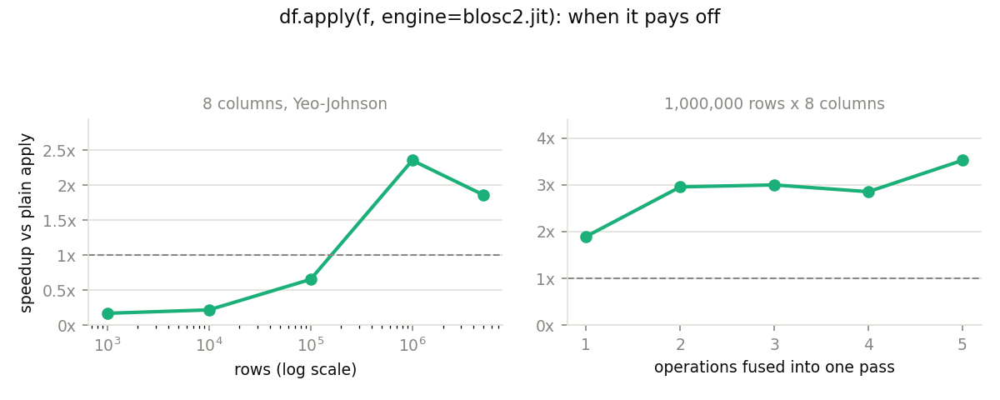

# Using Blosc2 with pandas

pandas' `DataFrame.apply` and `Series.map` accept an `engine=` argument, and
`blosc2.jit` is one such engine. Instead of running your function once per
element in a Python loop, pandas hands it the **whole column at once**, and
Blosc2 evaluates the entire function body in a single multi-threaded pass
over the data.

The result is typically **2-3x faster than a plain `apply`**, with the
function itself left exactly as you wrote it. That is the right tool for
transforms applied to each column independently (`axis=0`, the default).

For computations that combine several *columns* per row — the case pandas 3
highlights `engine=` for — a plain `@blosc2.jit` function called directly with
the columns as arguments is both simpler and faster, with wins well past
2-3x. [Jump to that section](#row-wise-computations-pass-the-columns-skip-apply)
if that is what you are here for.

## An example

Yeo-Johnson is the power transform behind scikit-learn's `PowerTransformer`,
used to make skewed features more normally distributed. Its parameter is
fitted per column, so applying it to every column of a feature matrix is
precisely what you want:

```python
import numpy as np
import pandas as pd

import blosc2

rng = np.random.default_rng(0)
df = pd.DataFrame({f"c{i}": rng.normal(size=1_000_000) for i in range(8)})


@blosc2.jit
def yeo_johnson(col, lam=0.5):
    # np.where evaluates both arms, so clamp each to its own domain
    pos = (np.power(np.maximum(col, 0.0) + 1.0, lam) - 1.0) / lam
    neg = -(np.power(np.maximum(-col, 0.0) + 1.0, 2.0 - lam) - 1.0) / (2.0 - lam)
    return np.where(col >= 0, pos, neg)


result = df.apply(yeo_johnson, engine=blosc2.jit)
```

`result` is a DataFrame of the same shape and column names as `df`, with the
transform applied to every column — the same thing plain `df.apply(yeo_johnson)`
returns, only computed differently. On the machine below it takes 0.057 s
instead of 0.126 s, a **2.2x** speedup.

## Why it is faster

Evaluated by NumPy, that function body is a sequence of separate steps: raise
to a power, subtract, divide, do it again for the negative branch, then select.
Each step walks the full column and allocates a new full-size temporary array
to hold its result.

Blosc2 does not execute the steps one at a time. It captures the whole
expression first, then makes a single pass over the data, computing every step
on one small piece while that piece is still in cache, and spreading the pieces
across cores. The intermediate arrays are never created.

## When it pays off

Two things have to be true, and the plot below measures each one on its own.



**Enough rows.** Setting up the compute engine costs a fixed amount per call.
At a few hundred thousand rows that setup is still larger than anything it
saves, and the engine is a net loss — at 100,000 rows it runs at 0.64x. Break-even
falls between 100,000 and 1,000,000 rows.

**Enough arithmetic.** The more operations there are to fuse into one pass, the
more temporaries are avoided and the bigger the win — from 2.1x for a single
operation up to 3.6x for five.

Beyond a few million rows the speedup flattens and then eases off (1.9x at 5M
above): the arrays no longer fit in cache and the whole computation becomes
limited by memory bandwidth, which fusion can reduce but not eliminate.

## When not to use it

**Trivial expressions.** Arithmetic intensity matters more than the raw number
of operations. A single cheap operation over a large array is limited by memory
bandwidth, not by computation, so there is nothing for the engine to win back:

```python
result = df.apply(lambda col: col + 1, engine=blosc2.jit)  # 0.53x — slower!
```

That runs at roughly **half** the speed of a plain `apply`. Reach for the engine
when the function does real work per element, such as transcendental functions
or several chained operations.

**Small frames.** See the plot above: below a few hundred thousand rows, use a
plain `apply`.

## Compared to `pd.eval` and numexpr

pandas' own [Enhancing performance](https://pandas.pydata.org/docs/user_guide/enhancingperf.html)
guide describes `pd.eval(..., engine="numexpr")`, which fuses expressions using
the same underlying idea. It is worth being straightforward about how the two
compare on the example above:

| approach | time | vs plain apply |
| --- | --- | --- |
| plain `df.apply(f)` | 0.1258 s | 1.00x |
| `df.apply(f, engine=blosc2.jit)` | 0.0569 s | 2.21x |
| `numexpr.evaluate(...)` per column | 0.0393 s | 3.20x |

On an in-memory DataFrame, numexpr is somewhat faster. The reason to prefer
`engine=blosc2.jit` is not raw speed but that **you write a Python function
rather than a quoted string**. The numexpr equivalent of `yeo_johnson` has to
become a single expression:

```python
"where(c >= 0, "
"((maximum(c, 0.0) + 1.0) ** lam - 1.0) / lam, "
"-((maximum(-c, 0.0) + 1.0) ** (2.0 - lam) - 1.0) / (2.0 - lam))"
```

The Blosc2 version keeps its intermediate variables and its name, can call
helper functions, can be unit-tested and reused elsewhere under `@blosc2.jit`,
and is checked by your editor and linters. That is the trade being offered.

Note also that Blosc2's characteristic strength — computing directly over
compressed, potentially larger-than-memory arrays — does not come into play on
this path, because pandas materialises each column as a plain NumPy array
before the engine ever sees it. It does come into play in the row-wise
pattern below: a `@blosc2.jit` function called directly accepts a
`blosc2.NDArray` operand exactly as readily as a DataFrame column.

## Gotchas

**`std()` silently changes meaning.** A plain `apply` passes your function a
pandas Series, whose `.std()` defaults to `ddof=1`. The engine passes a NumPy
array, whose `.std()` defaults to `ddof=0`. The same source code therefore
computes slightly different numbers depending on the engine. Pass `ddof`
explicitly if it matters:

```python
z = (col - col.mean()) / col.std(ddof=0)
```

**Your function is inspected once, not run over the values.** This is worth
understanding, because most of the surprises below follow from it. By default
the engine calls your function a single time, passing stand-in objects in place
of the columns. Those stand-ins compute nothing; they just record the operations
you ask for. What comes back is a description of the whole calculation, which
Blosc2 then evaluates over the real data in one fused pass. (The usual name for
this is *tracing*.) Your Python code therefore runs once, at setup — never per
row, which is exactly where the speed comes from.

The catch is that a plain Python `if` has nothing to look at during that single
call: it is handed the entire column, not one value, so it raises
`ValueError: The truth value of an array with more than one element is
ambiguous`. Branching on a scalar *parameter* is fine, and always was — only
branching on column values is affected.

**Real per-element `if`/`for`/`while` works too, for a numeric subset of
NumPy.** `engine=blosc2.jit` auto-detects control flow: if your function
branches or loops over column values *and* the function fits Blosc2's
[DSL grammar](../reference/dsl_syntax.md), it is compiled and run as written —
branches and loops behave like real Python — instead of being traced. Both
`np.sin(x)`-style calls and bare `sin(x)`-style calls are accepted (the former
is rewritten to the latter automatically; a handful of NumPy functions the DSL
knows under a different name, like `np.maximum`/`np.minimum`, are translated
too — `maximum`, `minimum` and `absolute` today). Two things to know
before relying on this:

- If the function doesn't fit the DSL grammar at all (e.g. it uses statements
  the grammar doesn't support), it silently falls back to the original
  behavior: the function is traced, and branching on array contents raises
  `ValueError: The truth value of an array ... is ambiguous`. Use `np.where`
  as before, nesting it where you would have used `elif`.
- If the function looks DSL-shaped but calls something outside the DSL's
  supported functions (not every NumPy function has a DSL equivalent),
  compiling it fails at call time with a `RuntimeError` naming the problem —
  a different error than the `ValueError` above, and one that is not silently
  swallowed. Check the [DSL syntax reference](../reference/dsl_syntax.md) for
  what is actually supported before depending on this path for a given
  function.

This dispatch decision is not configurable through `engine=`: pandas' engine
protocol requires the plain `blosc2.jit` object, so `engine=` always gets the
auto-detect (`strict=None`) behavior described above — there is currently no
way to pass `strict=True`/`strict=False` through this entry point.

**So why does the example above use `np.where` rather than an `if`?** Mostly
portability, not speed. Written with a real branch, `yeo_johnson` needs no
clamping at all, because only the matching arm runs for each element:

```python
@blosc2.jit
def yeo_johnson_branch(col):
    if col >= 0:
        out = (np.power(col + 1.0, 0.5) - 1.0) / 0.5
    else:
        out = -(np.power(-col + 1.0, 1.5) - 1.0) / 1.5
    return out


result = df.apply(yeo_johnson_branch, engine=blosc2.jit)
```

The `@blosc2.jit` decorator is optional here — `engine=blosc2.jit` compiles the
function either way — but it is harmless, and keeping it means the same
function also works when called directly.

That is the clearer statement of the transform, and on the same 1,000,000 × 8
frame it costs about 6%:

| approach | time | vs plain apply |
| --- | --- | --- |
| per-element Python, real `if` | 1.66 s (measured at 50,000 rows, scaled) | 0.08x |
| plain `df.apply(f)`, `np.where` | 0.1300 s | 1.00x |
| `engine=blosc2.jit`, real `if` (DSL kernel) | 0.0642 s | 2.02x |
| `engine=blosc2.jit`, `np.where` (traced) | 0.0606 s | 2.15x |

Two things to read off that table. A real `if` executed **by Python**, one value
at a time, is the slow option by a wide margin — 13x slower than a vectorized
`np.where` and about 26x slower than either engine path. That is the version to
avoid, and it is what people usually mean when they say branching is slow. But a
real `if` **compiled to a DSL kernel** is a different thing entirely: it lands
within a few percent of the traced form, because the branch's saved work
(only one arm runs) roughly cancels against the vectorized math the traced form
gets to use.

The traced `np.where` version stays in the example because it works whatever
your function contains, while the branch version only compiles if the whole
function fits the DSL grammar — note it already had to inline `lam`, since
`apply` passes the column alone. If your function does fit, prefer the branch:
it is easier to read and needs no domain clamping.

**`np.where` evaluates both arms.** Unlike a real `if`, both branches are
computed over the whole column and only then selected between, so each one runs
on values it was never meant to see. In `yeo_johnson` above, `np.power(col + 1.0,
0.5)` would hit a negative base wherever `col < -1` — around 159,000 elements in
a million-row standard normal — producing NaNs and a
`RuntimeWarning: invalid value encountered in power`. The final answer is still
correct, because `np.where` discards them, but the warning is noise and the work
is wasted. That is why each arm is clamped to its own domain with `np.maximum`.
The same caveat applies to numexpr's `where()`.

**A reduction used inside per-element control flow does not mean what it
looks like it means, in a DSL kernel.** `sum`, `max`, `min` and friends are
*block* reductions: they collapse the whole chunk being evaluated down to one
value, not one value per row. Writing the array-style idiom

```python
if max(abs(diff)) < 1e-12:
    break
```

inside a `@blosc2.jit` DSL kernel (see the DSL syntax reference and the
row-wise section below) does **not** raise — it compiles and runs, and
silently produces wrong results for every row past the first: only element 0
of the block receives the reduction's value, so the condition evaluates
against effectively-zero data everywhere else. This is a known rough edge in
the underlying [miniexpr](https://github.com/Blosc/miniexpr) compiler, not
something `blosc2.jit` can validate away today. Write the per-element form
instead — drop the reduction and compare the array directly:

```python
if abs(diff) < 1e-12:
    break
```

## Row-wise computations: pass the columns, skip `apply`

The previous sections cover `axis=0` — one function call per *column*, which
is where `engine=blosc2.jit` earns its 2-3x. `axis=1` — one call per *row* —
is what pandas 3 actually highlights `engine=` for, via examples like:

```python
def add_people(row):
    return row["max_people"] + row["max_children"]


visits = pd.DataFrame({"max_people": [4, 2, 8], "max_children": [1, 0, 3]})
visits.apply(add_people, engine=blosc2.jit, axis=1)
```

`engine=blosc2.jit` handles this specific shape reasonably well: a function
that only ever combines columns by name (`row["colname"]`, nothing fancier)
is detected and dispatched to one call over whole per-column arrays instead
of pandas' historical per-row Python loop, so it traces to a single fused
expression the same way `axis=0` does.

But for anything with real per-row iteration — a genuine per-row-convergence
computation, not just combining a few columns — `apply` is the wrong tool
regardless of `engine=`, and `engine=blosc2.jit` raises a clear `TypeError`
rather than attempting it (tracing would otherwise unroll the loop eagerly at
call time, and the traced expression size explodes with each iteration; see
[Gotchas](#gotchas) above for a related, subtler version of the same
`for`/`while`-with-a-reduction interaction). Skip `df.apply(...)` entirely and
call a `@blosc2.jit` function directly, passing the columns as separate array
arguments:

```python
import numpy as np
import pandas as pd

import blosc2

rng = np.random.default_rng(0)
orbits = pd.DataFrame(
    {
        "mean_anomaly": rng.uniform(0, 2 * np.pi, 1_000_000),
        "eccentricity": rng.uniform(0.0, 0.95, 1_000_000),
    }
)


# Eccentric anomaly via Newton-Raphson on Kepler's equation. Note: DSL kernel
# bodies do not support a docstring (or any other string-literal statement).
@blosc2.jit
def kepler(mean_anomaly, eccentricity):
    e = mean_anomaly + eccentricity * sin(mean_anomaly)
    for _ in range(100):
        diff = (e - eccentricity * sin(e) - mean_anomaly) / (
            1.0 - eccentricity * cos(e)
        )
        e = e - diff
        if abs(diff) < 1e-12:
            break
    return e


result = kepler(orbits["mean_anomaly"], orbits["eccentricity"])
```

That's it — no `apply`, no `engine=` keyword. `orbits["colname"]` (a pandas
Series) is accepted directly as a kernel operand, exactly like a NumPy array.

On 1,000,000 rows this runs **6.2x faster than fully vectorized NumPy**:

| approach | time (1M rows) |
| --- | --- |
| vectorized NumPy (whole-array loop) | 0.164 s |
| `kepler(orbits["mean_anomaly"], orbits["eccentricity"])` | 0.026 s |

A plain Python `df.apply(..., axis=1)` is far enough outside this range that
timing it at 1M rows isn't practical: measured on 2,000 rows it runs at
about 4.4 microseconds/row, versus 0.026 microseconds/row for the direct
call — **around 167x faster per row**, before even accounting for the
per-row work Python duplicates on every call (`sin`/`cos` reimported,
Newton step re-interpreted, ...) that the compiled kernel pays for once.

### Why it beats even vectorized NumPy

Vectorized NumPy still has to loop until the *worst* row converges — every
row keeps recomputing `sin`/`cos`/the Newton step for however many iterations
the slowest-converging row needs, because the loop is at the whole-array
level. The DSL kernel's `for`/`if`/`break` compile to a real, independent
per-element loop: each row exits as soon as *it* converges, and the compiled
loop runs as one fused, multi-threaded pass with no NumPy-sized temporaries
in between. See the [DSL syntax reference](../reference/dsl_syntax.md) for
what a kernel body may contain.

### What this costs

- `df["colname"]` and `df["colname"].to_numpy()` are a **zero-copy view** for
  ordinary numeric dtypes (confirmed via `np.shares_memory`, including
  mixed-dtype frames — extracting one column never triggers the whole-frame
  upcast that `df.to_numpy()` or `df.values` does, which is what
  `engine=blosc2.jit` uses internally for `axis=0`). Each column keeps its
  own dtype.
- Nullable (`Float64`/`Int64`), Arrow-backed, and tz-aware columns are not
  zero-copy — extracting them allocates a converted array once, which is
  noise next to iterative work like the kernel above.

### This isn't really a pandas feature

The kernel above takes arrays; a DataFrame column happens to *be* one (via
`__array__`). The same call works unmodified with a polars Series, an xarray
`DataArray`, an h5py dataset slice, or a `blosc2.NDArray` — where compressed
or larger-than-memory operands become relevant, unlike anywhere else on this
page. Treat `engine=blosc2.jit` as the pandas-specific on-ramp for column-wise
work, and a plain `@blosc2.jit` call as the general tool for everything else.

## When to use which

| situation | use |
| --- | --- |
| same function applied to every column independently | `df.apply(f, engine=blosc2.jit)` (`axis=0`) |
| a function combining a few named columns, no per-row loop | `df.apply(f, engine=blosc2.jit, axis=1)` — works, but consider the direct call below anyway |
| per-row convergence / iteration (Newton-Raphson class) | call the `@blosc2.jit` function directly with the columns, no `apply` |
| trivial arithmetic, or fewer than ~100,000 rows | plain pandas — neither engine wins here |

## Limitations

- Only numeric dtypes are supported. A non-numeric (e.g. object-dtype or
  string) column raises a `ValueError` naming the limitation rather than
  attempting the computation.
- `na_action="ignore"` is not supported for `map` and raises
  `NotImplementedError` — the vectorized-call contract means there is no
  per-element step at which to skip a value.
- `Series.apply(func, engine=...)` and `DataFrame.map(func, engine=...)` do
  not reach `blosc2.jit` at all: pandas 3's `Series.apply` does not accept
  an `engine` keyword for non-string functions, and `DataFrame.map` doesn't
  forward `engine` to a dispatch mechanism at all. These are limitations of
  the pandas-side API surface, not of the Blosc2 engine. The two entry
  points that do reach the engine are `DataFrame.apply` and `Series.map`.

`Series.map(func, engine=blosc2.jit)` works the same way as `DataFrame.apply`:
`func` is called once with the Series' full underlying array.

## Reproducing these numbers

All figures on this page come from `bench/bench_pandas_engine.py`, measured on
an Apple M4 with pandas 3.0.3 and 8 threads. Run it yourself with:

```
python bench/bench_pandas_engine.py
```

It prints the `engine=` comparison table, both sweeps, the row-wise Kepler
table above, and regenerates the plot.
