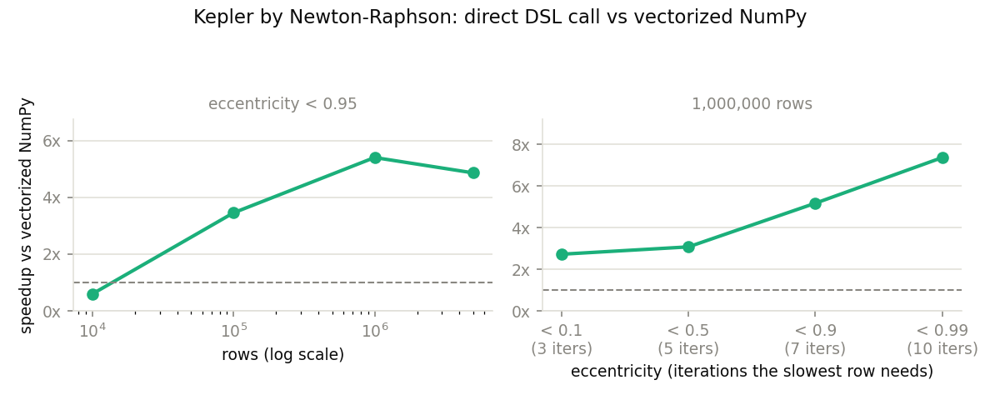

# Using Blosc2 with pandas

There are two ways to make a pandas computation faster with Blosc2, and which
one you want depends on a single question: **does your function work on one
column at a time, or does it combine several columns per row?**

| your function | use | typical win |
| --- | --- | --- |
| transforms one column (`axis=0`) | `df.apply(f, engine=blosc2.jit)` | 2-3x |
| combines columns, one result per row | `f(**df)` — no `apply` at all | 5-7x |

Both need a decent amount of data and a decent amount of arithmetic to be
worth it; the sections below say how much.

## One column at a time: `engine=blosc2.jit`

`DataFrame.apply` and `Series.map` accept an `engine=` argument, and
`blosc2.jit` is one such engine. pandas hands your function the **whole column
at once**, and Blosc2 evaluates the entire function body in a single
multi-threaded pass.

Yeo-Johnson — the power transform behind scikit-learn's `PowerTransformer` —
is a good fit: its parameter is fitted per column, so you apply it to every
column of a feature matrix.

```python
import numpy as np
import pandas as pd

import blosc2

rng = np.random.default_rng(0)
df = pd.DataFrame({f"c{i}": rng.normal(size=1_000_000) for i in range(8)})


@blosc2.jit
def yeo_johnson(col, lam=0.5):
    # np.where evaluates both arms, so clamp each to its own domain
    pos = (np.power(np.maximum(col, 0.0) + 1.0, lam) - 1.0) / lam
    neg = -(np.power(np.maximum(-col, 0.0) + 1.0, 2.0 - lam) - 1.0) / (2.0 - lam)
    return np.where(col >= 0, pos, neg)


result = df.apply(yeo_johnson, engine=blosc2.jit)
```

You get back the same DataFrame plain `df.apply(yeo_johnson)` would return,
computed differently: 0.058 s instead of 0.121 s, a **2.1x** speedup.

The win comes from not materialising intermediates. NumPy runs that body one
operation at a time, allocating a full-size temporary array at each step.
Blosc2 captures the whole expression first, then makes one pass over the data,
computing every step on a small piece while it is still in cache and spreading
the pieces across cores.

### When it pays off


**Enough rows** (left): setup costs a fixed amount per call, so break-even
falls between 100,000 and 1,000,000 rows. Below that, use a plain `apply`.
Beyond a few million the win eases off — the data no longer fits in cache and
memory bandwidth becomes the limit.

**Enough arithmetic** (right): the more operations there are to fuse, the more
temporaries are skipped — 1.9x for a single operation, 3.5x for five. One
cheap operation over a big array wins nothing at all
(`df.apply(lambda col: col + 1, engine=blosc2.jit)` runs at *half* the speed
of a plain `apply`). Reach for the engine when the function does real work per
element.

`pd.eval(..., engine="numexpr")` fuses expressions the same way and is
somewhat faster here; the reason to prefer `engine=blosc2.jit` is that you
write a Python function instead of a quoted expression string. See
[Details](#details).

## Several columns per row: skip `apply`, pass the columns

This is the case pandas 3 highlights `engine=` for, and it is where `apply` is
the wrong shape: its contract is one call per row. A `@blosc2.jit` function
takes one parameter per column and is called directly — and since a DataFrame
unpacks into one keyword argument per column, that call is just `f(**df)`.

Kepler's equation, solved per row by Newton-Raphson:

```python
rng = np.random.default_rng(0)
orbits = pd.DataFrame(
    {
        "mean_anomaly": rng.uniform(0, 2 * np.pi, 1_000_000),
        "eccentricity": rng.uniform(0.0, 0.95, 1_000_000),
    }
)


@blosc2.jit
def kepler(mean_anomaly, eccentricity):
    e = mean_anomaly + eccentricity * sin(mean_anomaly)
    for _ in range(100):
        diff = (e - eccentricity * sin(e) - mean_anomaly) / (
            1.0 - eccentricity * cos(e)
        )
        e = e - diff
        if abs(diff) < 1e-12:
            break
    return e


orbits["E"] = kepler(**orbits)
```

No `apply`, no `engine=`. The parameter names match the column names, so `**`
does the wiring; each column arrives as a pandas Series, which the kernel
accepts like any array (zero-copy for ordinary numeric dtypes). `**df` passes
*every* column, so subset first if the frame has more:
`kepler(**orbits[["mean_anomaly", "eccentricity"]])`.

On 1,000,000 rows that runs in 0.027 s against 0.165 s for fully vectorized
NumPy — **6.2x** — and about 164x faster per row than a plain
`df.apply(..., axis=1)`.

### Why it beats even vectorized NumPy

Vectorized NumPy has to keep looping until the *worst* row converges: the loop
is at the whole-array level, so every row pays for the slowest one. The
kernel's `for`/`if`/`break` compile to a real per-element loop, so each row
stops as soon as *it* converges — and the whole thing still runs as one fused,
multi-threaded pass.



That explanation predicts the right-hand panel, which varies orbital
eccentricity — i.e. how much harder the worst row is than a typical one. With
near-circular orbits every row converges in the same 3 iterations, there is
nothing for `break` to skip, and the win falls to 2.7x. With near-parabolic
ones the slowest row needs 10 iterations while the average needs 4, and the
win climbs to 7.4x. **The more uneven the work per row, the more this
pattern wins.** The left panel is the familiar row-count story: break-even
around 20,000 rows, 3.5x at 100,000.

Note that the kernel never learns it was handed a DataFrame. The same call
works with polars, xarray, h5py — or a `blosc2.NDArray`, which is how you
reach compressed, larger-than-memory operands. Only the `**df` spelling is
pandas-specific.

### If your function has no per-row loop

`df.apply(f, engine=blosc2.jit, axis=1)` does work for functions that merely
combine columns by name (`row["a"] + row["b"]`): they are dispatched to a
single whole-column call rather than a per-row Python loop. Add a `for` or
`while` to that idiom and it raises a `TypeError` pointing back here — that
shape can only be compiled, not traced.

## Gotchas

**Your function normally runs only once.** The engine calls it a single time
with stand-in objects that record operations rather than compute them, then
evaluates the recorded expression over the real data (this is *tracing*). So a
plain `if` on column values has nothing to look at and raises `ValueError: The
truth value of an array ... is ambiguous`. Use `np.where`, or write the
function so it compiles instead — see below.

**Real `if`/`for`/`while` works, if the function fits the DSL.** When your
function branches or loops over column values *and* fits Blosc2's
[DSL grammar](../reference/dsl_syntax.md), it is compiled and runs as written,
branches and all — that is what makes the Kepler kernel above possible. If it
doesn't fit the grammar, it silently falls back to tracing (hence the
`ValueError`); if it looks DSL-shaped but calls an unsupported function, you
get a `RuntimeError` naming it.

**`np.where` evaluates both arms.** Both branches are computed over the whole
column before one is selected, so each runs on values it was never meant to
see — negative bases, divisions by zero, `RuntimeWarning`s. The answer is
still correct, but clamp each arm to its own domain (as `yeo_johnson` does
with `np.maximum`) to keep the noise and wasted work away.

**Don't put a reduction inside per-element control flow.** In a DSL kernel,
`sum`/`max`/`min` collapse the whole block being evaluated to a single value,
not one per row. So `if max(abs(diff)) < 1e-12: break` compiles, runs, and
silently gives wrong results for every row but the first. Write the
per-element form: `if abs(diff) < 1e-12: break`.

**`std()` changes meaning.** A plain `apply` passes a pandas Series
(`ddof=1`); the engine passes a NumPy array (`ddof=0`). Pass `ddof` explicitly
if it matters.

## Limitations

- Numeric dtypes only; anything else raises `ValueError`.
- `na_action="ignore"` is not supported for `map` (`NotImplementedError`):
  there is no per-element step at which to skip a value.
- Only `DataFrame.apply` and `Series.map` reach the engine. pandas 3's
  `Series.apply` doesn't accept `engine=` for non-string functions, and
  `DataFrame.map` doesn't forward it — both are pandas-side limits.
- `engine=` always gets auto-detection: pandas' protocol requires the plain
  `blosc2.jit` object, so `strict=True`/`strict=False` cannot be passed
  through it (a direct call can).

## Details

Two things worth knowing once you are actually using this, neither needed to
get started.

**Against numexpr.** pandas' own
[Enhancing performance](https://pandas.pydata.org/docs/user_guide/enhancingperf.html)
guide describes `pd.eval(..., engine="numexpr")`, which fuses expressions on
the same principle. On the Yeo-Johnson example:

| approach | time | vs plain apply |
| --- | --- | --- |
| plain `df.apply(f)` | 0.121 s | 1.00x |
| `df.apply(f, engine=blosc2.jit)` | 0.058 s | 2.07x |
| `numexpr.evaluate(...)` per column | 0.039 s | 3.09x |

numexpr is faster on an in-memory frame, so the trade is not raw speed: its
version of `yeo_johnson` has to collapse into one quoted string,
`"where(c >= 0, ((maximum(c, 0.0) + 1.0) ** lam - 1.0) / lam, ...)"`, while
the Blosc2 version stays a Python function — intermediate variables, a name,
helper calls, unit tests, and your linter. Note also that neither
`engine=blosc2.jit` nor numexpr touches compressed data here: pandas
materialises each column as a plain NumPy array first. Only the direct-call
pattern reaches `blosc2.NDArray` operands.

**What column extraction costs.** `df["col"]` is a zero-copy view for ordinary
numeric dtypes, including in mixed-dtype frames: pulling out one column never
triggers the whole-frame upcast that `df.to_numpy()` does (which is what
`engine=blosc2.jit` uses internally for `axis=0`), and each column keeps its
own dtype. Nullable (`Float64`/`Int64`), Arrow-backed and tz-aware columns are
the exception — they allocate a converted array once, which is noise next to
iterative work like the Kepler kernel.

## Reproducing these numbers

All figures on this page come from `bench/bench_pandas_engine.py`, measured on
an Apple M4 with pandas 3.0.3 and 8 threads:

```
python bench/bench_pandas_engine.py
```

It prints every table on this page and regenerates both plots.
