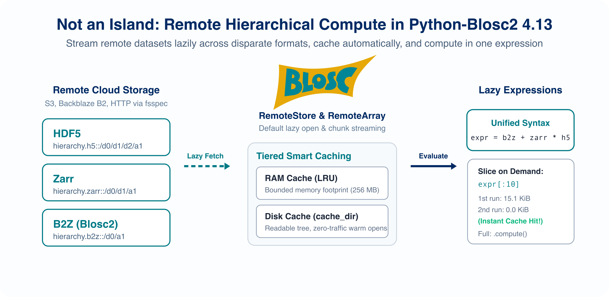

# Working with Remote Arrays

`RemoteArray` opens one remote array without downloading it first. Source
metadata is read at open time; payload is fetched when indexing or computation
needs it. See {doc}`remote_objects` for RemoteStore navigation, shared cache and
traffic semantics, credentials, reference mutability, and object lifetimes. See
{doc}`remote_tables` for CTable access.

## Choose a remote route

The argument passed to {func}`blosc2.open` selects the route:

| Argument                                                                      | Route    | What it names                                           |
| ----------------------------------------------------------------------------- | -------- | ------------------------------------------------------- |
| A URL string such as `s3://...` or `https://...`                              | fsspec   | A byte-addressable, standalone `.b2nd` file             |
| A URL containing a `.b2z` path component, or `source_format="b2z"`            | B2Z      | One immutable external NDArray leaf in a `.b2z` archive |
| A URL containing a `.zarr` path component                                     | Zarr     | One immutable Zarr v2 or v3 array                       |
| A URL containing a `.h5` or `.hdf5` path component, or `source_format="hdf5"` | HDF5     | One immutable HDF5 dataset (h5py locally, native range index remotely) |
| A {ref}`URLPath`                                                              | Caterva2 | One array-like dataset on a Caterva2 server             |

```python
import blosc2

# fsspec: a plain web server, CDN, or cloud object store
a1 = blosc2.open("https://datasets.example.org/big.b2nd", lazy=True)
a2 = blosc2.open("s3://bucket/big.b2nd", lazy=True)

# Caterva2: a dataset identified by root and path
b = blosc2.open(
    blosc2.URLPath(
        "@public/examples/lung-jpeg2000_10x.b2nd",
        urlbase="https://cat2.cloud/demo",
    ),
    lazy=True,
)

# Open individual datasets inside containers (B2Z, Zarr, or HDF5)
# Datasets can be named using slashes (/), container separators (::), or dataset=:
b1 = blosc2.open("s3://bucket/hierarchy.b2z/d0/d1/a2", lazy=True)
c1 = blosc2.open("https://datasets.example.org/hierarchy.zarr::d0/d1/a2", lazy=True)
h1 = blosc2.open(
    "https://datasets.example.org/hierarchy.h5", lazy=True, dataset="d0/d1/a2"
)

# Open whole hierarchies with RemoteStore to discover and navigate containers:
store_b2z = blosc2.RemoteStore("s3://bucket/hierarchy.b2z")
store_h5 = blosc2.RemoteStore("https://datasets.example.org/hierarchy.h5")

# Reopen an exported portable snapshot (.b2z):
store_snap = blosc2.open("snapshot.b2z")

a1.shape, a1.dtype  # metadata is available immediately
a1[100:110, :50]  # data is fetched now
```

Remote B2Z needs `pip install "blosc2[fsspec]"`.
HTTP and HTTPS URLs work out of the box; cloud object stores need their respective protocol driver (such as `s3fs` for S3, `gcsfs` for GCS, or `adlfs` for Azure).
It accesses external `ZIP_STORED` NDArray members in `.b2z` archives using native Blosc2 chunk and block range reads without decompressing or downloading the archive.
For a suffix-free URL, pass `source_format="b2z"`.
Embedded leaves and CTable columns are not supported as lazy NDArrays.

Remote Zarr needs `pip install "blosc2[zarr,fsspec]"`.
HTTP/HTTPS works directly; cloud stores require their protocol driver (`s3fs` for S3, etc.).
Datasets can be named directly by path (`/sub/arr`), with the `::sub/arr` separator, or via `dataset="sub/arr"`.
For a suffix-free URL, pass `source_format="zarr"`.
Converted Blosc2 chunks are cached under an immutable source contract, so publish changed data at a new URL or replace its cache.

Remote HDF5 needs `pip install "blosc2[hdf5,fsspec]"`.
HTTP/HTTPS works directly; cloud stores require their protocol driver (`s3fs` for S3, etc.).
Datasets can be specified using standard slash syntax (`file.h5/d0/d1/a2`), the double-colon separator (`file.h5::d0/d1/a2`), or the `dataset="d0/d1/a2"` parameter.
Remote pre-indexing uses h5py to record dataset metadata and allocated chunk byte ranges. When opening a single {ref}`RemoteArray`, the native index is cached inside the array carrier (`schunk.vlmeta["hdf5-index"]`). When using {ref}`RemoteStore`, indexing is performed once for the entire container and shared across all leaves and sessions. Uncompressed, deflate, shuffle, and Blosc2 pipelines are decoded directly after fsspec range reads. Other pipelines use a retained h5py reader, including filters registered by `hdf5plugin`.
Use `blosc2.available_datasets(url)` to inspect datasets in an HDF5 container.

An explicitly selected dataset is discovered directly; unrelated siblings and
PyTables index groups are deferred. Complete hierarchy opens discover all nodes,
but allocated-chunk maps are built only when a leaf is first read. Remote HDF5
objects up to 8 MiB are fetched once and retained for the source session, because
one bounded transfer is cheaper than many metadata ranges. A warm disk cache
restores discovery metadata without downloading the complete source again.

For published immutable data, a native index can be generated once and served as
an explicit JSON sidecar. The sidecar is Blosc2 metadata; the HDF5 file is not
modified, and the filename has no required convention:

```python
import json

import blosc2

source = "https://example.com/readings.h5"
index = blosc2.scan_hdf5_index(source)
with open("readings.h5.b2index.json", "w") as file:
    json.dump(index, file)

table = blosc2.open(
    source + "::readings",
    hdf5_index="https://example.com/readings.h5.b2index.json",
)
```

`hdf5_index=` accepts a dictionary, local JSON path, or remote fsspec URL and
works for arrays, PyTables tables, and hierarchy stores. `scan_hdf5_index()`
creates a complete container index by default; pass `dataset=` to create an index
scoped to one dataset or group subtree. A scoped index can only open that exact
dataset, or a store rooted at that group. The
recorded source URL must exactly match the URL being opened. Regenerate the
sidecar whenever the source object changes; remote HDF5 sources otherwise follow
the same immutable-URL contract as the cache. `storage_options` are used for
both source and sidecar URLs.

Sidecars are never probed automatically: an explicit `hdf5_index=` avoids adding
a failed metadata request to sources that do not publish one. Version-1 native
indexes remain readable; legacy Kerchunk/reference maps are not native indexes
and are rejected.

Local HDF5 files use h5py directly, without pre-indexing or an fsspec
dependency. For example, `blosc2.open("hierarchy.h5::/d0/a2")` reads the selected
dataset through h5py and caches converted Blosc2 chunks in memory. Explicit
`hdf5_index=` also accepts a native HDF5 index for local files. Legacy HDF5
reference maps are rejected; omit it to regenerate the native index.

`RemoteArray` assumes remote sources are immutable by default, avoiding a metadata request before every read.
For a replaceable `.b2nd` or Caterva2 source, pass `assume_immutable=False` to refresh its identity and invalidate stale cached chunks before each operation.
Mutable B2Z, Zarr, and HDF5 sources are not supported.

A `URLPath` always means Caterva2.
If its `urlbase` is omitted, the server comes from {func}`blosc2.c2context` or `BLOSC_C2URLBASE`.
Other transports can be added with a custom {ref}`ByteRangeNDSource`; see [Use your own transport](#use-your-own-transport).

## Operating with remote arrays

Remote arrays can be operands in lazy expressions. Opening an array and building the expression only reads metadata; data is fetched when the expression is sliced or computed. A shared `cache_dir` keeps downloaded chunks locally between runs:



```python
import blosc2

base = "https://s3.us-west-001.backblazeb2.com/blosc2/hierarchy"

with (
    blosc2.open(f"{base}.h5::/d0/d1/d2/a1", lazy=True, cache_dir="remote-cache") as h5,
    blosc2.open(f"{base}.zarr::/d0/d1/a1", lazy=True, cache_dir="remote-cache") as zarr,
    blosc2.open(f"{base}.b2z::/d0/a1", lazy=True, cache_dir="remote-cache") as b2z,
):
    expr = b2z + zarr * h5
    print(expr[:10])  # fetches only the chunks needed for the first 10 values
    result = expr.compute()  # materializes the full result as an NDArray
```

The three leaves above have shape `(10000,)`, so they can be combined directly. Keep HDF5 opens before Zarr opens when using several remote formats in one process.

### Choosing between fsspec and Caterva2

When opening an individual dataset with `lazy=True`, both fsspec URLs and Caterva2 `URLPath`s return a {ref}`RemoteArray`, providing an identical user interface for slicing, caching, and introspection.
For multi-dataset containers (B2Z, Zarr, and HDF5), a {ref}`RemoteStore` is returned instead, providing container-level discovery and shared caching across fsspec protocols.

What differs between the transports is the types of remote objects each can open:

| Remote object                           | fsspec URL / RemoteStore         | Caterva2 `URLPath`           |
| --------------------------------------- | -------------------------------- | ---------------------------- |
| Standalone contiguous `.b2nd`           | Yes (`blosc2.open` / `RemoteArray`) | Yes                       |
| NDArray leaf inside `.b2z`              | Yes (`blosc2.open` / `RemoteArray`) | Yes                       |
| CTable inside `.b2z`                   | Yes (`blosc2.open` / `RemoteCTable`) | No                        |
| Zarr v2/v3 array                        | Yes (`blosc2.open` / `RemoteArray`) | No                        |
| HDF5 dataset                            | Yes (`blosc2.open` / `RemoteArray`) | Yes                       |
| Lazy or computed array                  | No                               | Yes                          |

- **fsspec** supplies byte ranges.
  Python-Blosc2 parses the remote frame to discover its geometry and chunk offsets, making this route direct and efficient for standalone arrays.
- **Caterva2** understands dataset paths, array metadata, and slicing.
  It can therefore expose array-like data that is not stored as a standalone Blosc2 frame, as well as apply authentication or server-side computation.
  Use Caterva2's navigation API to find a leaf in a remote hierarchy, then open that leaf with a `URLPath`.

`lazy=True` changes *when* data is fetched; it does not expand the underlying storage formats supported by either route.

```{tip}
**Browse remote hierarchies**: To explore groups, inspect attributes, or preview arrays in remote `.b2z`, `.zarr`, or `.h5` containers interactively in the terminal without downloading the complete container, use {doc}`b2view <b2view>` (e.g. `b2view s3://bucket/hierarchy.b2z`). To navigate containers programmatically in Python, use {ref}`RemoteStore`.
```

## Explore remote hierarchies with RemoteStore

RemoteStore discovery and navigation now live in {doc}`remote_objects`. This
heading remains as a pointer for existing links.

## Access HTTP/HTTPS, S3, and cloud storage

Shared fsspec, cloud authentication, and concurrency guidance is in
{doc}`remote_objects`. Array-specific supported formats remain in
[Choose a remote route](#choose-a-remote-route).

## Cache policies and memory management

The MEMORY, DISK, and NONE policies are described in {doc}`remote_objects`.
Array reads, prefetching, and materialization below all use that shared policy.

## Only what a slice touches

Blosc2 arrays are compressed in chunks, which are divided into smaller blocks.
For a small slice, fetching only its blocks can avoid transferring most of a large chunk.


Purple regions are cached; red regions are still remote, and they do not use local storage.
The grid is schematic: where byte ranges are available, the fetched regions can be blocks within a chunk.
`fetch()` warms the cache and returns the remote array, whereas indexing returns the requested values.

The remote array chooses blocks or whole chunks automatically.
It fetches a whole chunk when most of its blocks are needed or when the source cannot expose block ranges, as with computed Caterva2 datasets.
Independent reads overlap, with up to eight concurrent requests by default; use `max_concurrency=1` when concurrency does not help.

Stepped slices also use the block grid.
For example, `a[::5]` can reduce transfers along an axis whose blocks do not already span that axis.

### Explicit cache pre-fetching

You can warm the cache proactively using `fetch()` or `afetch()`:

```python
# Synchronously pre-fetch a region into the cache:
a.fetch(slice(0, 10_000))

# Or asynchronously in an async event loop:
await a.afetch(slice(10_000, 20_000))
```

Both methods return `a`.
Prefetched data may be evicted to satisfy the cache limit; later indexing fetches it again as needed.
Use `a.materialize(item)` for an independent, complete `NDArray`.
Its output and temporary buffer are outside the cache limit.

> [!NOTE]
> `fetch()` and `afetch()` require a writable cache. On an immutable cache snapshot (such as an archive opened with `mutable=False`), pre-fetching raises an error.

`a.cache` exposes the underlying cache for inspection.
It may contain missing or evicted chunks and must not be treated as a complete array or mutated by callers.

Operations on a single handle are serialized through fetching, result assembly, eviction, and export.
Async methods run synchronous operations in a worker thread; cancelling the await does not stop an already running fetch.
Separate handles or processes sharing a disk carrier require external locking.

## Measure network traffic

Shared traffic accounting and examples are in {doc}`remote_objects`.

## Persist and reopen remote references

### Persist a remote array reference (.b2nd)

Use {ref}`RemoteArray` directly when a `.b2nd` file should carry a portable remote descriptor and, optionally, its own bounded persistent cache:

```python
remote = blosc2.RemoteArray(
    "s3://bucket/big.b2nd",
    cache_policy=blosc2.CachePolicy.NONE,
)
remote.save("big-reference.b2nd")

# Or create a named cache carrier explicitly:
remote = blosc2.open(
    "s3://bucket/big.b2nd",
    lazy=True,
    cache_path="big-cache.b2nd",
    mode="a",
)
remote[:100]
```

The saved object contains source and geometry metadata but no credentials.
A `.b2nd` carrier is a local cache/reference file for a remote array, not a second copy of the remote dataset itself: it stores the source locator plus any warm compressed chunks that have already been fetched. This is why a file such as `big-cache.b2nd` can be reopened later and continue serving cached reads without re-fetching the remote source. To create a visible file with a predictable name, set `cache_path="big-cache.b2nd"` when opening the remote array or call `save("big-cache.b2nd")` on the live handle.
With `CachePolicy.NONE`, repeated reads contact the source and do not mutate the carrier.
With `CachePolicy.DISK`, the carrier file itself is the cache and retains compressed chunks up to its payload limit.
DISK and MEMORY arrays preserve valid warm chunks by default.
Pass `include_cache=False` to export a cold copy without mutating the warm carrier.

Store and table `.b2z` references, cache mutability, and the distinction between
`save()` and `materialize()` are documented in {doc}`remote_objects`.

## Retrieve scattered points

A remote array maps coordinate arrays and boolean masks to the blocks that contain their selected points:

```python
a[rows, :100]
a[mask]
```

For Caterva2, a bare {ref}`C2Array` can be substantially more efficient for one-off point queries: it sends coordinates to the server, which evaluates the selection and returns only the selected values.
Prefer direct `C2Array` indexing for sparse, one-off point retrieval; prefer a {ref}`RemoteArray` when reuse through a local cache matters.

## Remote tables

Remote CTable access, filtering, buffering, saving, and materialization now live
in {doc}`remote_tables`. This heading remains as a pointer for existing links.

## Handle remote changes

### Standalone arrays and Caterva2 sources

A persistent cache records the source identity when one is available.
On a later `blosc2.open()` with the same `cache_dir` or `cache_path`, a mismatched cache is discarded and rebuilt automatically.

When constructing a proxy directly in append mode, a mismatch is reported instead:

```python
p = blosc2.Proxy(source, urlpath="cache.b2nd", mode="a")
# ValueError if cache.b2nd belongs to different remote bytes
```

Use `mode="w"` to start that cache again.
If a source cannot provide an identity, compatibility is checked only from shape, dtype, chunks, and blocks.
Use a fresh cache when such a source may have changed without changing its geometry.

For a replaceable `.b2nd` or Caterva2 source, pass `assume_immutable=False` to check for updates and invalidate stale cached chunks before each operation.

RemoteStore and RemoteCTable refresh behavior is documented in
{doc}`remote_objects` and {doc}`remote_tables`.

## Fill a Caterva2 array concurrently

Several writers can fill one Caterva2 array when each chunk is written at most once.
First create and upload an uninitialized array with its final geometry:

```python
import blosc2
import numpy as np

blosc2.uninit(
    (1_000_000,),
    dtype=np.float64,
    chunks=(100_000,),
    blocks=(10_000,),
    urlpath="run.b2nd",
)
```

```sh
cat2-client upload run.b2nd @personal/run.b2nd
```

Each writer compresses and posts the chunks it owns:

```python
import math

a = blosc2.C2Array("@personal/run.b2nd", urlbase="https://cat2.cloud/demo")
chunk = blosc2.compress2(
    data,
    typesize=a.dtype.itemsize,
    blocksize=math.prod(a.blocks) * a.dtype.itemsize,
)

try:
    a.update_chunk(nchunk, chunk)
except blosc2.ChunkAlreadyWritten:
    pass  # another writer completed this slot
```

The server serializes updates, and {meth}`C2Array.written_chunks() <blosc2.C2Array.written_chunks>` reports progress from the array's index:

```python
written = a.written_chunks()
for nchunk in np.flatnonzero(~written):
    ...  # chunks still missing after a restart
```

## Use your own transport

Subclass {ref}`ByteRangeNDSource` when the frame lives behind a transport that fsspec cannot use:

```python
import boto3
import blosc2


class S3Source(blosc2.ByteRangeNDSource):
    def __init__(self, bucket, key):
        self.s3 = boto3.client("s3")
        self.bucket, self.key = bucket, key
        self.stamp = self.s3.head_object(Bucket=bucket, Key=key)["ETag"]
        super().__init__(f"s3://{bucket}/{key}")

    def read_range(self, offset, size):
        response = self.s3.get_object(
            Bucket=self.bucket,
            Key=self.key,
            Range=f"bytes={offset}-{offset + size - 1}",
        )
        data = response["Body"].read()
        self.traffic.charge(len(data))
        return data


a = blosc2.Proxy(S3Source("bucket", "big.b2nd"), urlpath="cache.b2nd", mode="a")
```

Initialize the transport before `super().__init__()`, because the base constructor immediately reads the frame header.
Make `read_range()` thread-safe, set `stamp` so persistent caches can detect changes, and charge the bytes read so traffic measurements remain accurate.

For ordinary remote access, use `blosc2.open("https://...", lazy=True)` or `blosc2.open("s3://bucket/big.b2nd", lazy=True)`; the custom class only illustrates the transport contract.

## See also

- {doc}`Tutorial 6 <../tutorials/06.remote_proxy>` — a step-by-step introduction with output.
- `examples/remote/s3-access.py` — remote access across Blosc2 (.b2nd, .b2z), Zarr, and HDF5 with timing and network traffic metering.
- `examples/remote/store-browse.py` — inspecting hierarchies, leaf previews, and shared caching across leaves.
- `examples/remote/lazy-expr.py` — evaluating a lazy expression over remote B2Z, Zarr, and HDF5 arrays.
- `examples/remote/c2array-get-slice.py` — opening and reading remote Caterva2 arrays via URLPath.
- `examples/remote/c2array-traffic.py` — block, chunk, and cached transfer sizes against Caterva2.
- `examples/remote/c2array_expr.py` — lazy expression evaluation on remote Caterva2 arrays.
- `examples/remote/concurrent-fsspec.py` — concurrent chunk fetching (`max_concurrency`) on high-latency stores.
- `examples/remote/fsspec-cat2-access.py` — one dataset and cache through fsspec and Caterva2.
- `examples/remote/proxy-carray.py` — creating a persistent local disk proxy of a remote Caterva2 array.
- `examples/remote/rw-fsspec.py` — fsspec reading and writing examples.
- {doc}`b2view <b2view>` — interactive terminal browser for local and remote containers.
- {doc}`remote_objects` — shared remote caching, traffic, references, and hierarchy navigation.
- {doc}`remote_tables` — remote CTable access.
- {ref}`RemoteArray`, {ref}`C2Array`, {ref}`B2ZNDSource`, {ref}`ZarrNDSource`, {ref}`HDF5NDSource`, {ref}`FsspecNDSource`, {ref}`ByteRangeNDSource`, and {ref}`Proxy` — API reference pages.
