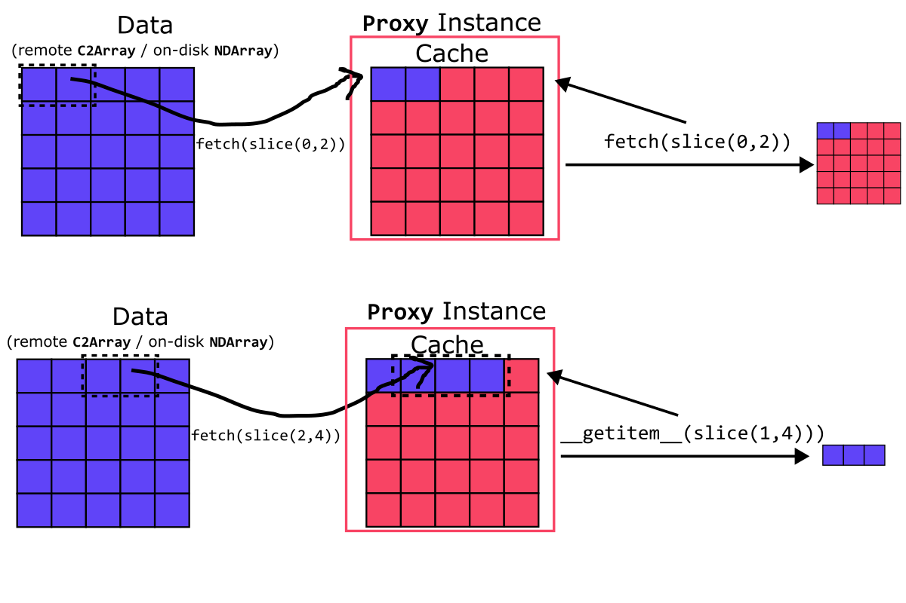

# Working with Remote Arrays

Blosc2 can open an array without downloading it first. Metadata is read at open time; array data is fetched only when a slice needs it and is then kept in a local cache.

## Choose a remote route

The argument passed to {func}`blosc2.open` selects the route:

| Argument | Route | What it names |
|---|---|---|
| A URL string such as `s3://...` or `https://...` | fsspec | A byte-addressable, standalone `.b2nd` file |
| A {ref}`URLPath` | Caterva2 | One array-like dataset on a Caterva2 server |

```python
import blosc2

# fsspec: an object store or plain web server
a = blosc2.open("s3://bucket/big.b2nd", lazy=True)

# Caterva2: a dataset identified by root and path
b = blosc2.open(
    blosc2.URLPath(
        "@public/examples/lung-jpeg2000_10x.b2nd",
        urlbase="https://cat2.cloud/demo",
    ),
    lazy=True,
)

a.shape, a.dtype  # metadata is available immediately
a[100:110, :50]  # data is fetched now
```

A `URLPath` always means Caterva2. If its `urlbase` is omitted, the server comes from {func}`blosc2.c2context` or `BLOSC_C2URLBASE`. Other transports can be added with a custom {ref}`ByteRangeNDSource`; see [Use your own transport](#use-your-own-transport).

### What each route supports

Both routes return a {ref}`Proxy` when opened with `lazy=True`, so slicing and caching work the same way. Their sources differ:

| Remote object | fsspec URL | Caterva2 `URLPath` |
|---|---|---|
| Standalone contiguous `.b2nd` | Yes | Yes |
| HDF5 dataset | No | Yes |
| NDArray leaf inside `.b2z` | No | Yes |
| Lazy or computed array | No | Yes |
| Whole `.b2z` `TreeStore` or `DictStore` | No | No; open one array-like leaf |

fsspec supplies byte ranges. Python-Blosc2 parses the `.b2nd` frame to discover its geometry and chunk offsets, making this route direct and efficient for standalone arrays.

Caterva2 understands dataset paths, array metadata, and slicing. It can therefore expose array-like data that is not stored as a standalone Blosc2 frame, as well as apply authentication or server-side computation. Use Caterva2's navigation API to find a leaf in a remote hierarchy, then open that leaf with a `URLPath`.

`lazy=True` changes when data is fetched; it does not expand the formats supported by either route.

## Choose a cache

Every lazy open creates a cache. By default it lives in memory and disappears with the proxy:

```python
a = blosc2.open("s3://bucket/big.b2nd", lazy=True)
a[10:12, 500:600]  # fetched and cached
a[10:12, 500:600]  # served from memory
```

Set `cache_dir` to let Blosc2 manage a cache file inside a directory:

```python
url = "s3://bucket/big.b2nd"

a = blosc2.open(url, lazy=True, cache_dir="./b2cache")
a[100:110, :50]  # fetched and stored under ./b2cache

# A later process can reuse the same cache.
a = blosc2.open(url, lazy=True, cache_dir="./b2cache")
a[100:110, :50]  # no request
```

Use `cache_path` instead when the cache should have an exact filename:

```python
a = blosc2.open(url, lazy=True, cache_path="big-cache.b2nd")
```

In both cases, the cache is an ordinary `.b2nd` array that starts small and grows as regions are read. `cache_dir` and `cache_path` are mutually exclusive.

Authenticated Caterva2 caches must be private to one user. Reopen them under an equivalent authenticated {func}`blosc2.c2context`; do not share a cache directory between users.

## Only what a slice touches

Blosc2 arrays are compressed in chunks, which are divided into smaller blocks. For a small slice, fetching only its blocks can avoid transferring most of a large chunk.



Purple regions are cached; red regions are still remote. The grid is schematic: where byte ranges are available, the fetched regions can be blocks within a chunk. `fetch()` fills and returns the cache container, whereas indexing returns only the requested values.

The proxy chooses blocks or whole chunks automatically. It fetches a whole chunk when most of its blocks are needed or when the source cannot expose block ranges, as with computed Caterva2 datasets. Independent reads overlap, with up to eight concurrent requests by default; use `max_concurrency=1` when concurrency does not help.

Stepped slices also use the block grid. For example, `p[::5]` can reduce transfers along an axis whose blocks do not already span that axis. A bare {ref}`C2Array` does not accept stepped slices; its proxy does.

### Measure network traffic

{ref}`C2Array` and remote {ref}`Proxy` objects expose cumulative request and byte counts through {ref}`Traffic`:

```python
source = blosc2.C2Array(
    "@public/examples/kevlar-tomo.b2nd",
    urlbase="https://cat2.cloud/demo",
)
p = blosc2.Proxy(source)

p.traffic.reset()
corner = p[0, :100, :100]
print(p.traffic)  # requests and bytes fetched

p.traffic.reset()
p[0, :100, :100]
print(p.traffic)  # Traffic(requests=0, nbytes=0)
```

Use `reset()` or subtract two readings to measure one operation. `Proxy.traffic` is `None` for a local source because no network transport exists.

`examples/c2array-traffic.py` compares block, chunk, and cached reads against a live Caterva2 dataset.

## Retrieve scattered points

A proxy maps coordinate arrays and boolean masks to the blocks that contain their selected points:

```python
p[rows, :100]
p[mask]
```

For Caterva2, a bare {ref}`C2Array` can be substantially more efficient: it sends the coordinates to the server, which returns only the selected values. Prefer direct `C2Array` indexing for sparse, one-off point retrieval; prefer a proxy when reuse through a local cache matters.

## Handle remote changes

A persistent cache records the source identity when one is available. On a later `blosc2.open()` with the same `cache_dir` or `cache_path`, a mismatched cache is discarded and rebuilt automatically.

When constructing a proxy directly in append mode, a mismatch is reported instead:

```python
p = blosc2.Proxy(source, urlpath="cache.b2nd", mode="a")
# ValueError if cache.b2nd belongs to different remote bytes
```

Use `mode="w"` to start that cache again. If a source cannot provide an identity, compatibility is checked only from shape, dtype, chunks, and blocks. Use a fresh cache when such a source may have changed without changing its geometry.

## Fill a Caterva2 array concurrently

Several writers can fill one Caterva2 array when each chunk is written at most once. First create and upload an uninitialized array with its final geometry:

```python
import blosc2
import numpy as np

blosc2.uninit(
    (1_000_000,),
    dtype=np.float64,
    chunks=(100_000,),
    blocks=(10_000,),
    urlpath="run.b2nd",
)
```

```sh
cat2-client upload run.b2nd @personal/run.b2nd
```

Each writer compresses and posts the chunks it owns:

```python
import math

a = blosc2.C2Array("@personal/run.b2nd", urlbase="https://cat2.cloud/demo")
chunk = blosc2.compress2(
    data,
    typesize=a.dtype.itemsize,
    blocksize=math.prod(a.blocks) * a.dtype.itemsize,
)

try:
    a.update_chunk(nchunk, chunk)
except blosc2.ChunkAlreadyWritten:
    pass  # another writer completed this slot
```

The server serializes updates, and {meth}`C2Array.written_chunks() <blosc2.C2Array.written_chunks>` reports progress from the array's index:

```python
written = a.written_chunks()
for nchunk in np.flatnonzero(~written):
    ...  # chunks still missing after a restart
```

## Use your own transport

Subclass {ref}`ByteRangeNDSource` when the frame lives behind a transport that fsspec cannot use:

```python
import boto3
import blosc2


class S3Source(blosc2.ByteRangeNDSource):
    def __init__(self, bucket, key):
        self.s3 = boto3.client("s3")
        self.bucket, self.key = bucket, key
        self.stamp = self.s3.head_object(Bucket=bucket, Key=key)["ETag"]
        super().__init__(f"s3://{bucket}/{key}")

    def read_range(self, offset, size):
        response = self.s3.get_object(
            Bucket=self.bucket,
            Key=self.key,
            Range=f"bytes={offset}-{offset + size - 1}",
        )
        data = response["Body"].read()
        self.traffic.charge(len(data))
        return data


a = blosc2.Proxy(S3Source("bucket", "big.b2nd"), urlpath="cache.b2nd", mode="a")
```

Initialize the transport before `super().__init__()`, because the base constructor immediately reads the frame header. Make `read_range()` thread-safe, set `stamp` so persistent caches can detect changes, and charge the bytes read so traffic measurements remain accurate.

For ordinary S3 access, use `blosc2.open("s3://bucket/big.b2nd", lazy=True)`; the custom class only illustrates the transport contract.

## See also

- {doc}`Tutorial 6 <../tutorials/06.remote_proxy>` — a step-by-step introduction with output.
- `examples/ndarray/rw-fsspec.py` — fsspec reading and writing examples.
- `examples/fsspec-cat2-access.py` — one dataset and cache through fsspec and Caterva2.
- `examples/c2array-traffic.py` — block, chunk, and cached transfer sizes.
- {ref}`C2Array`, {ref}`FsspecNDSource`, {ref}`ByteRangeNDSource`, {ref}`Proxy`, and {ref}`Traffic` — API reference pages.
