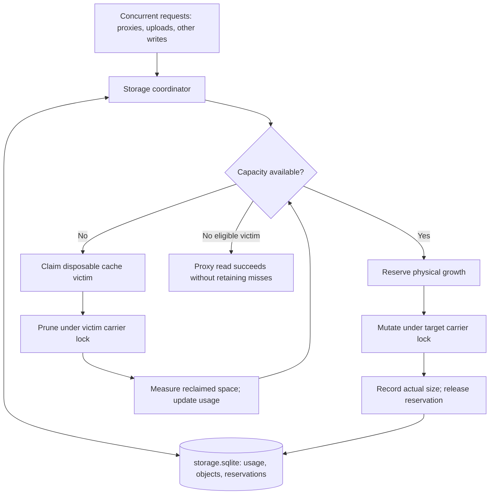

# Plan: Shared storage reservations and growable remote proxies under customer quota (v5)

## Status and objective

First staged-replacement implementation added to Caterva2. The design below
records the original proposal; the implementation decisions and remaining work
in the next section supersede its open choices. This is not a claim that every
benchmark, optimization, or observability item below is complete.

## Implementation decisions and remaining work

- `services/storage_quota.py` uses standard-library `sqlite3`, WAL, FULL
  synchronous transactions, schema version 1, and separate `account`, `objects`,
  and `operations` tables. Connections are short-lived and never shared between
  threads/processes. Usage is summed transactionally rather than duplicated in
  independently updated counters.
- Owned `public`, `shared`, and `personal` regular files are charged by `st_size`.
  Peer storage retains its separate budget. Media, authentication files,
  SQLite/WAL, directories, and lock sidecars are excluded operational storage.
  This deliberately replaces the old whole-state-directory accounting boundary.
- Candidates are built in memory, then reserve positive final-size growth and
  their entire staging-file size before disk writes. `quota_work_bytes` defaults
  to `"1G"` and bounds aggregate coordinated disk staging. It does not bound RAM,
  HTTP request spooling, operational metadata, or old inodes held by readers;
  customer quota is not a guarantee against filling the underlying volume.
- Atomic replacement is the selected correctness reference. Stable per-path OS
  locks fence publishers and recovery; generation checks reject stale snapshots.
  No heartbeat or TTL frees a live writer's reservation. Recovery syncs the
  surviving target, cleans operation-owned staging, then records actual size.
  Admission pressure also attempts recovery of other dead workers' operations.
- A shared initialization barrier fences startup inventory against publishers.
  Startup reconciles offline changes and reduced quotas. External online writers
  are unsupported. All workers must use the same configuration. Local
  `publish_root` cannot point into the server's state directory under quota.
- Quota-enabled uploads/imports, chunk writes, append, expression output,
  notebooks, HDF5 proxy creation, copying/moving, deletion, publishing metadata,
  and archive extraction use shared admission. Directory/archive operations are
  file-by-file, not transactional batches; moves copy before deleting and need
  capacity for both. Reserved `.b2lock` sidecars may keep removed directories
  from disappearing. Arbitrary out-of-band writes from user code are not covered.
- Both logical slices and compressed chunk requests retain DISK misses only
  after admission; denials, contention, and publication failure retain the
  fetched result. Finite and unlimited payload caps remain distinct from quota.
  MEMORY still executes as NONE; portable descriptors and client defaults do
  not change. No new Python-Blosc2 runtime API was required.
- One bounded reclamation pass can cold-replace up to four previously validated
  DISK carriers, oldest first, after recovery and an admission retry. Descriptor
  and user metadata survive; cache bitmaps, indexes, and payload are cleared
  together. Generation checks fence stale victims. Ordinary data is not evicted.
- `StorageQuota.usage()` reports committed, reserved, and working bytes. Public
  admin endpoints, persistent denial/recovery counters, precise reclaimable-byte
  reporting, finer victim fairness/hysteresis, and optimized partial pruning
  remain follow-up work.

### Validation and performance baseline

New local tests cover exact admission, metadata overhead, separate staging
budgets, independent-process competition, live-owner recovery fencing, worker
death before/after replacement, offline reconciliation, open reader snapshots,
generation conflicts, source reads on denial/SQLite failure, cross-proxy pruning,
threaded uploads versus fills, and authenticated writer/fetch API integration.
The existing remote-proxy and API tests are also used as regression coverage.
Validation in the blosc2 environment: 89 quota/resolver tests passed with
warnings treated as errors. The authenticated API, chunk-write and HDF5 suites
passed with customer quota temporarily enabled in the isolated test server
(292 passed, 4 skipped); they also passed without quota (292 passed, 4 skipped).
The temporary configuration was restored and was not installed in the checkout.
The publication regression test now waits for its own fill nonce, not a stale
published file left by an earlier test. Basic partial-block-to-whole-chunk
transitions and legacy Python UDF persistence have dedicated quota tests.
This does not yet exercise every host-power-loss boundary, every supported OS,
or a production-volume parallel workload.

`examples/benchmark_storage_quota.py` in Caterva2 compares staged admission to
the existing non-quota in-place path (not a quota-safe in-place implementation).
One local macOS run with an 8 MiB incompressible array and an in-memory upstream:

| Chunk size | In-place cold ms/fill | Staged cold ms/fill | Staged warm ms/read | Candidate bytes written |
| --- | ---: | ---: | ---: | ---: |
| 256 KiB | 0.952 | 8.955 | 8.323 | 138,463,971 |
| 1 MiB | 1.712 | 7.918 | 6.958 | 37,756,992 |

Whole-carrier copying also penalizes warm reads. These are illustrative
microbenchmark measurements, not production performance claims. Efficient warm
reads, a proven-bound in-place path, many-tiny-chunk/partial-block stress tests,
and the broader contention/peak-storage benchmark matrix remain follow-up work.
Large candidates exceeding the staging budget fall back to no retention.

Restore automatic DISK RemoteProxy cache fills when a Caterva2 customer has a
configured storage quota. Coordinate growth across that customer's proxies,
uploads, and other storage writers, and eventually reclaim disposable cached
chunks across proxies when capacity is needed.

Keep the v4 read-only behavior as the safe fallback until admission and recovery
are complete: reuse valid warm chunks, serve misses temporarily, and retain
nothing when permission to grow cannot be established.

## Deployment and execution model

Confirmed assumptions:

- One customer's virtual Caterva2 server runs on one host with local storage.
- Its worker processes share one state directory and one customer storage quota.
- Different customers have independent state directories and quota accounts.
- Peer access reaches independent Caterva2 servers on other machines. The local
  server accounts for locally retained peer data; no quota database is shared
  with the upstream server.
- A proxy does not own a dedicated process or thread. Async requests dispatch
  blocking operations to a shared thread pool, and multiple server processes may
  handle requests for the same carrier.

These assumptions permit SQLite coordination across local processes. Sharing the
database across hosts or a network filesystem is outside this design.

## Existing implementation anchors

Paths in this section are relative to the Caterva2 repository at
`/Users/faltet/ironArray/caterva2`, inspected during the v4/v5 discussion.

- `caterva2/services/db.py`: authentication uses SQLAlchemy and aiosqlite with
  `<statedir>/db.sqlite`. The schema currently contains the user table.
- `caterva2/services/server.py::lifespan`: initializes/disposes that database
  conditionally on authentication. Storage coordination must not inherit that
  dependency on login being enabled.
- `caterva2/services/srv_utils.py::Database`: `<statedir>/db.json` holds server
  state as an in-memory model rewritten to JSON. It is not a transactional quota
  store and must not be used for cross-worker reservations.
- `server.py::get_disk_usage`, `get_disk_usage_written`, and
  `account_chunk_written`: current accounting uses directory scans and a
  process-local counter. These are insufficient for shared admission.
- `server.py::remote_proxy_cache_limit`: currently returns zero under customer
  quota. `read_remote_proxy` and the `api/chunk` branch use that allowance.
- `services/remote_proxy.py::ServerRemoteProxy`: receives an already authorized
  source, uses the carrier for DISK caching, and supports read-only warm reuse
  with temporary miss assembly when cache allowance is zero.
- `server.py::dataset_lock`, `dataset_thread_lock`, and
  `remote_proxy.py::carrier_thread_lock`: existing process-local guards accompany
  Blosc2 carrier file locks. Preserve their ordering and thread/GIL protections.
- `caterva2/c2cache/peercache.py`: existing peer-cache pruning provides useful
  chunk-eviction and recency mechanisms, but its scans and post-growth eviction
  do not implement cross-worker storage reservations.

Python-Blosc2 anchors are `src/blosc2/proxy.py` for fetched bitmaps, physical
chunks, size accounting, and eviction, and `src/blosc2/remote_proxy.py` for the
portable carrier contract. A new physical-growth planning hook may be needed;
it is not assumed to exist today.

## Proposed architecture

Introduce a local storage coordinator, backed by `<statedir>/storage.sqlite`.
Every quota-consuming server mutation asks it for admission. SQLite coordinates
ownership of capacity; per-carrier locks protect file contents and readers.



Network fetching occurs outside SQLite transactions. Successful reservations
remain recorded while filesystem work runs; they do not require an open database
transaction. Pruning must be bounded so repeated admission retries cannot loop
indefinitely under pressure.

Use a dedicated database rather than extending authentication tables. This
separates lifecycle, schema migration, and frequent accounting traffic from user
management while reusing the installed SQLite/aiosqlite infrastructure.

## Accounting contract

For one quota account, the admission invariant is:

```text
committed chargeable storage + outstanding reserved growth <= customer quota
```

If existing data already exceeds a newly configured or reduced quota, preserve
user data, prohibit positive-growth admissions, and allow reads and safe pruning.
Do not pretend the invariant already holds during that reconciliation state.

Distinguish two different limits:

- The carrier's `max_cache_bytes` bounds retained compressed cache payload. A
  null DISK limit disables its own LRU bound.
- Customer quota bounds chargeable physical file growth, including carrier
  headers, indexes, bitmaps, and metadata. It cannot be implemented by passing
  remaining customer capacity as a compressed-payload limit.

An unlimited carrier has no private cache cap, but it never bypasses customer
admission. MEMORY continues to execute as NONE on Caterva2; no server memory
cache registry or memory quota is introduced.

### Scope decisions required before implementation

Define chargeable files once and reuse that definition for migration, scanning,
admission, and reconciliation. Inventory public, shared, personal, peer-cache,
temporary, and internal state files. Existing peer-cache budgets are separate
policies; do not accidentally exclude their physical files from customer quota
if they are currently counted. Either make their writers participate or explicitly
document and implement a different accounting boundary.

Decide whether quota means apparent file length (matching current `st_size`
accounting) or allocated filesystem blocks. Proposed first version: retain
`st_size` semantics and describe this as chargeable stored bytes, not a guarantee
against exhausting the underlying volume.

Database/WAL/SHM files, lock sidecars, and working storage need an explicit policy.
Recommended: distinguish managed data quota from bounded operational headroom,
and do not charge recursive growth of the quota ledger through its own ledger.
The operational budget must still be provisioned and bounded. This is a deliberate
accounting-policy decision, not permission to create unlimited temporary files.

## Database model and lifecycle

Suggested minimal tables (final SQL and migration strategy are implementation work):

| Table | Core fields | Role |
| --- | --- | --- |
| `storage_usage` | account ID, quota, committed bytes, reserved bytes, reconciliation state | One account per customer state directory |
| `objects` | stable object ID, relative path, generation, measured bytes, type, cache eligibility, coarse last-use time | Identify storage and pruning candidates |
| `operations` | operation ID, object ID, owner token, expected generation, reserved bytes, state, heartbeat, recovery metadata | Durable reservations and mutation intent |
| `schema_version` | version | Explicit migrations independent of authentication |

Avoid counting the same reservation both in the usage row and operation rows
without transactional updates and a reconciliation check. Add nonnegative-value
constraints and uniqueness rules for live object mutation claims.

Initialize storage coordination for quota-enabled servers regardless of login.
Use one database engine/pool per process; do not share connections across process
forks. All workers must see the same configured quota. WAL and a bounded busy
timeout are candidates; configure them explicitly and verify their behavior in
multi-process tests. Use durable transaction settings suitable for reservations.

Use short write transactions, such as `BEGIN IMMEDIATE`, to check capacity and
create/update the reservation atomically. Handle SQLite contention explicitly;
cache admission may fall back to no retention after bounded retries.

Do not place network transfers, filesystem scans, carrier copying, or waits for
file locks inside a SQLite transaction. Do not update database recency per block
read; batch/coarsen touches so hot reads do not serialize on the SQLite writer.

## Growth workflow

1. Resolve the remote source through the existing authorized filesystem path.
   Fetch missing data into operation-scoped buffers outside database transactions.
   Apply existing request/resource controls and a bounded working-storage policy.
2. Prepare a candidate change or conservative physical-growth bound. Acquire the
   target carrier's existing mutation guards and verify source identity, geometry,
   and carrier generation. If preparation used an earlier generation, revalidate
   or rebuild before admission.
3. In a short database transaction, verify object ownership/generation and reserve
   positive physical growth if capacity permits. Persist mutation intent and an
   operation token. Commit the database transaction before filesystem mutation.
4. Perform the admitted mutation under the carrier lock. Never exceed the reserved
   physical-growth bound. If more space is required, acquire an additional
   reservation before that growth or abandon the candidate safely.
5. Measure the result and finalize in a short transaction: update object size and
   generation, adjust committed bytes, consume/release the reservation, and mark
   the operation complete.
6. Return the logical result whether retention was admitted or not. Failure of
   retention must not turn a successfully fetched result into incomplete data.

Uploads and ordinary user writes differ at step 6: admission denial returns the
existing appropriate quota error rather than silently losing a requested write.
Replacement credits old storage only when it is actually replaced; two live
copies during staging must not be counted as one if working storage is included.

## Determining physical growth: prototype before selecting the production path

### Option A: staged carrier replacement

Build a candidate carrier, measure its serialized file size, and publish it only
after admission and generation validation. This provides an exact final-size
baseline and keeps rejected candidates from modifying the live carrier.

Costs and required checks:

- Copying/rebuilding large carriers per small fill may be prohibitive. Batch
  chunk admissions where practical and measure write amplification.
- Temporary space must be bounded before candidate creation; final-size
  admission alone does not bound peak physical occupancy.
- Atomic rename does not by itself make SQLite and filesystem state atomic.
- Verify how carrier sidecar locks, already open handles, inode replacement,
  downloads, and platform-specific rename behavior interact. All relevant readers
  must obey a compatible lifetime/locking protocol.
- Persist enough intent to distinguish an unpublished candidate from a published
  replacement whose database finalization was interrupted. Flush/fsync ordering
  and parent-directory durability must be specified.

Use this as the correctness reference, not an assumption that replacing files is
already safe with the existing open-handle behavior.

### Option B: reserve a proven bound and mutate in place

Preferable for frequent chunk fills if Python-Blosc2/C-Blosc2 can provide a
reliable upper bound on all physical growth, including metadata and any temporary
rewrite space. A cache update planning/admission hook may be necessary.

Do not guess a fixed metadata allowance or reserve only compressed chunk bytes.
Specify interrupted-write behavior, accounting updates, and rollback/recovery
before enabling this path. If a reliable bound cannot be established, retain
the staged reference path or skip retention.

Benchmark both paths on cold and warm carriers, many tiny chunks, large contiguous
frames, partial blocks, and batches. Select the production path from measured
costs and demonstrated correctness.

## Pruning across proxies

After shared admission works, permit reclaiming disposable DISK cache payload
from other proxies. Preserve descriptors, geometry, original data, and user
metadata. Cache eviction must use the cache engine's bookkeeping-aware mechanisms,
not raw chunk replacement that leaves fetched bits or indexes inconsistent.

Start with coarse per-proxy recency and prune chunks in batches. Keep per-proxy
LRU for its own cap. Define priority so a hot proxy cannot repeatedly strip every
other proxy's working set; use hysteresis/bounded work to avoid fill-prune thrash.

Pruning sequence:

1. Select and claim an eligible victim in a short transaction. Do not credit the
   space expected to be reclaimed.
2. End the transaction, acquire that carrier's guards, and revalidate the claim,
   generation, and eligibility. Skip active or unavailable victims after bounded
   waiting.
3. Evict a batch safely and measure the resulting physical file length. If pruning
   itself needs temporary growth, account for it before starting.
4. Commit the measured reduction and release the claim. Only now can reservations
   spend the freed capacity.

Avoid holding the requesting carrier's lock while waiting for a victim's lock.
Release/revalidate the requester when necessary. Keep one consistent lock order:
carrier guard may enclose short SQLite work, but an open SQLite transaction must
never wait for a carrier. No operation should hold multiple carrier locks for a
routine pruning pass.

## Crash recovery and reconciliation

SQLite transactions do not include B2ND file writes. Model operations explicitly,
for example `reserved -> applying -> completed`, with an aborted/recovering path.
Finalize and abort operations idempotently using their unique tokens.

Recovery must cover:

- Reservation committed, filesystem work never started.
- Partial in-place write or partially built candidate.
- Replacement published, final size not recorded in SQLite.
- Pruning completed, reclaimed capacity not yet credited.
- Worker cancellation, process termination, host restart, or ledger unavailability.

A heartbeat timeout is only a signal to investigate. Do not free a reservation
while its owner might still write. Recovery needs carrier-lock acquisition,
owner/generation fencing, and inspection of actual files. An old worker must
verify its token is still authorized before publishing or mutating after a claim
has been recovered. Prefer conservative over-accounting until reconciliation.

Initial inventory and recovery scans must not race untracked writers. Establish
an initialization/reconciliation barrier, handle multiple workers starting at
once, and define how explicit out-of-band filesystem edits are detected. External
uncoordinated writers cannot be covered by a strict online quota guarantee.
If the ledger is unavailable or inconsistent, serve reads without new retention
and fail quota-controlled user mutations clearly rather than bypassing admission.

## Implementation stages

### Stage 1: shared accounting and reservations

- Add `services/storage_quota.py` (proposed module), schema migration, startup,
  shutdown, inventory, and recoverable reservation primitives.
- Audit every physical writer: uploads, URL imports, chunk writes, array/store
  creation, replacements, transformations/unfolding, deletion/rename, and any
  chargeable peer-cache or background writes.
- Route all quota-consuming writers through the coordinator. Preserve quota
  error semantics for explicit user mutations.
- Test contention and recovery independently of remote cache filling.
- Keep quota-enabled remote caches read-only until the writer audit is complete.

### Stage 2: admit DISK proxy growth

- Prototype and benchmark physical-growth strategies, including working storage.
- Integrate the selected strategy into both slice/index and compressed-chunk
  requests while retaining the authorized source and existing locks.
- Enforce both the private payload cap and shared physical quota. Support null
  DISK limits and finite limits equally.
- Retain misses when reservation succeeds; otherwise return fetched results
  without retaining them. No automatic cross-proxy pruning is required yet.
- Preserve warm/cold exports, source invalidation, and MEMORY-to-NONE behavior.

### Stage 3: coordinated cross-proxy pruning

- Add coarse recency, victim claims, safe batch eviction, fairness, and bounded
  admission retry after actual reclamation.
- Permit pruning for explicit uploads as well as cache fills if that product
  policy is accepted; never reclaim ordinary user data automatically.
- Add diagnostics for used/reserved/reclaimable bytes, denied cache admissions,
  recovered operations, and pruning. Do not expose credentials or source secrets.

## Test and benchmark matrix

- Two processes reserve against one quota: e.g. with 100 MiB free, 70 MiB and
  50 MiB requests cannot both be admitted without intervening reclamation.
- Threads, separate event loops, and separate server workers; no dedicated worker
  per proxy assumed. Database startup and schema initialization races included.
- Carrier metadata causes more growth than compressed payload; reservation covers
  the full admitted change. Include partial-block and many-small-chunk cases.
- Upload competes with proxy fill, two distinct proxies fill concurrently, and
  chunk writes compete with both. All use the same account.
- Quota full, quota reduced below existing usage, ledger busy/unavailable, and
  no reclaimable chunks: reads still succeed without cache growth.
- A victim is in use, replaced, deleted, or warmed after candidate selection;
  no stale decision corrupts data or frees fictitious capacity.
- Kill a worker at each filesystem/database boundary and recover exactly once;
  a paused old worker cannot publish after its claim is fenced out.
- Warm cache reads, bounded/unbounded transitions, source replacement, logical
  fetches, compressed chunks, and physical downloads retain v4 correctness.
- Working-storage exhaustion, replacement with live readers, pruning failure,
  cancellation, and process restart leave valid carriers or recoverable state.
- Measure database contention, transactions per fill, latency, staging peak space,
  bytes rewritten per admitted chunk, and pruning churn under parallel workloads.

Use deterministic local upstream fixtures and multi-process tests on temporary
local state directories. Run Python and test/build commands in the blosc2 conda
environment. No runtime tests are claimed by this planning document.

## Acceptance and non-goals

V5 is complete when quota-enabled servers can safely grow DISK proxy caches,
different workers cannot spend the same capacity, physical growth is admitted
before it happens, and interrupted operations reconcile without under-accounting
or corrupted reads. Cross-proxy pruning only credits verified reclaimed space.

No new carrier format or changed client MEMORY default is required. Distributed
quota coordination, shared network-filesystem SQLite, private/signed upstream
server access, server MEMORY retention, and hard process-RAM limits are out of
scope. SQLite is the local coordination mechanism, not a substitute for carrier
integrity locks or for a defined filesystem durability protocol.

## SQLite references

- [Transactions](https://www.sqlite.org/lang_transaction.html): write transaction
  admission, BEGIN IMMEDIATE, and contention behavior.
- [Write-ahead logging](https://www.sqlite.org/wal.html): concurrent readers,
  single-writer coordination, checkpoints, and the same-host constraint.
